# naloga 2

```mermaid
flowchart LR
A[FILM]
B[STUDIO]
C[IGRALCI]
D[ŽANR]

A---A1((_fid_))
A---A2((naslov))
A---A3((leto_izdaje))

B---B1((_sid_))
B---B2((ime))
B---B3((lokacija))

C---C1((_iid_))
C---C2((ime))
C---C3((priimek))

D---D1((_zid_))
D---D2((tip))

A-- "(1,n)" ---E{igra}-- "(1,n)" ---C
A-- "(1,1)" ---F{izdan}-- "(1,n)" ---B
A-- "(1,n)" ---G{spada}-- "(1,n)" ---D
```


```SQL
CREATE TABLE studio(
sid int,
ime varchar(20) not null,
lokacija varchar(20) not null,
PRIMARY KEY (sid)
);
CREATE TABLE zanr(
zid int,
tip varchar(15) not null,
PRIMARY KEY (zid)
);
CREATE TABLE igralci (
iid int,
ime varchar(15) not null,
priimek varchar(15) not null,
PRIMARY KEY (iid)
);
CREATE TABLE film (
fid int,
naslov varchar(20) not null,
leto_izdaje date not null,
sid int NOT NULL DEFAULT,
PRIMARY KEY (fid),
FOREIGN KEY (sid) REFERENCES studio
    ON DELETE SET DEFAULT ON UPDATE CASCADE
);
CREATE TABLE igra (
fid int not null,
iid int not null,
PRIMARY KEY (fid,iid),
FOREIGN KEY (fid) REFERENCES film
    ON DELETE CASCADE ON UPDATE CASCADE,
FOREIGN KEY (iid) REFERENCES igralci
    ON DELETE CASCADE ON UPDATE CASCADE
);

CREATE TABLE je_zanr (
fid int not null,
zid int not null,
PRIMARY KEY (fid,zid),
FOREIGN KEY (fid) REFERENCES film
    ON DELETE CASCADE ON UPDATE CASCADE,
FOREIGN KEY (zid) REFERENCES zanr
    ON DELETE CASCADE ON UPDATE CASCADE
);
```
# naloga 3
zelo podobna, 