# Implementacija slovarja
## b drevesa
za razliko od dvojiških imajo vozlišča lahko več ključev, razedlimo pa lahko na k+1 podrazredov. Ključi so urejeni, med dvema ključema pa velja strogo večje ali manjjše. ker so vsi listi na istem nivoju, se lahko uravnotežijo.

rastejo "od spodaj navzgor"

### Primer:
v b drevo reda 5(=b) vstavi naslednje elemente(ključe)
20, 40, 10, 30, 15, 35, 7, 26, 18, 22, 5, 42, 13, 46, 27, 8, 32, 24, 45, 25

ker je reda 5 je so notri največ 4 elementi. nasednji element se vstavi naprej
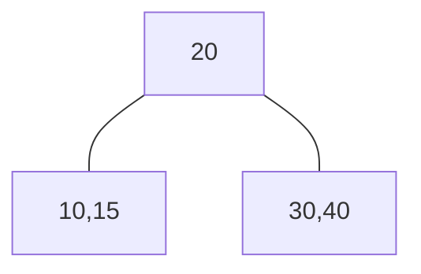
vstavimo naslednje: 35, 7, 26, 18
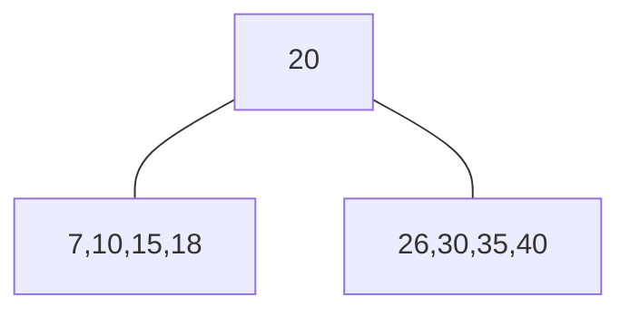
Vstavimo 22:
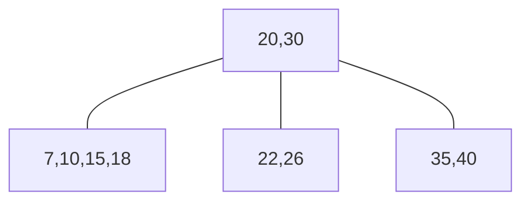
Vstavimo: 5
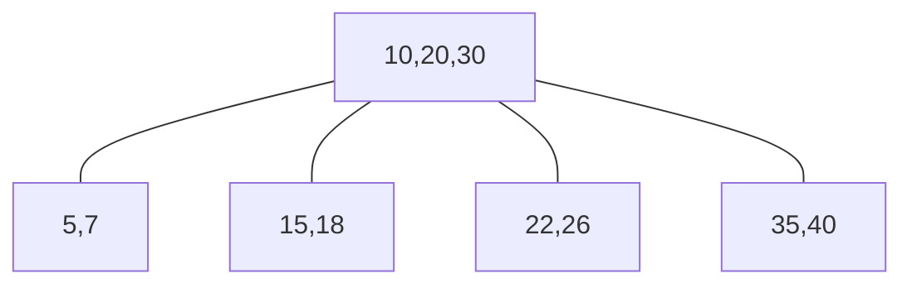
Vstavimo: 13, 46, 27, 8, 32
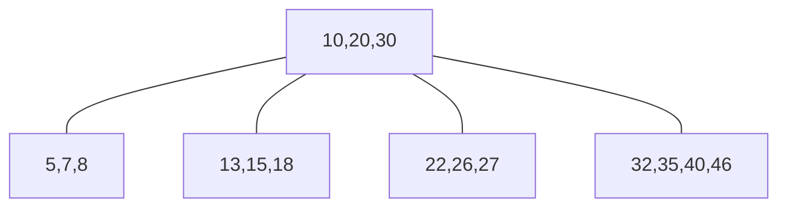
Vstavimo: 42
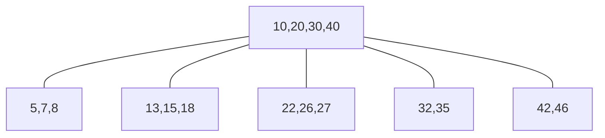
Vstavimo: 24, 45
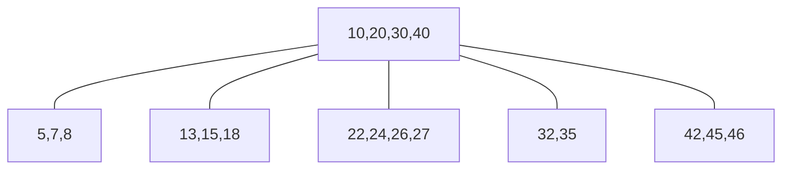
Vstavimo 25:
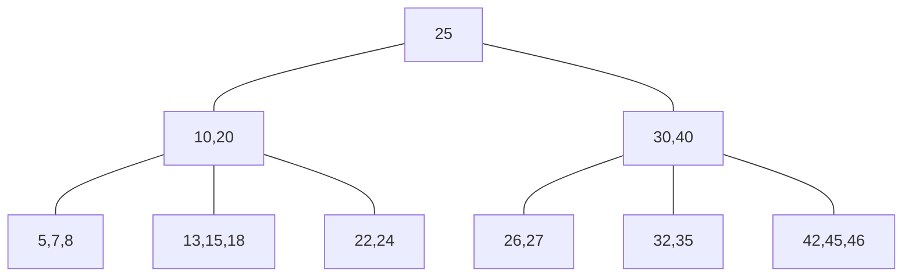
koliko je višina: $\log_n$(če je b konstanta)
**Brisanje:** 25
minimalno število je:2 ker je reda 5. ko zbrisemo naredimo podobno kot pri binarnem:
brišemo x in nadomestimo z max(levega) ali pa min(desnega)
ker so v nekaterih reda 1(<2) se jih prestavi gor, in preuredi drevo.
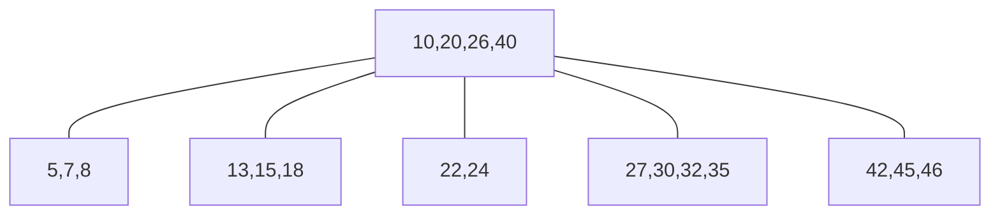
**Brisanje:** 45, 24, 32
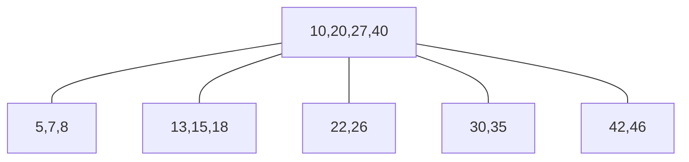
#### Primer: B drevo reda 4
v b drevesu reda 4 vstavimo naslednje elemente: 22,11,6,13,17,27,8,15,1
največ: 3 ključi
najman: 1 ključ
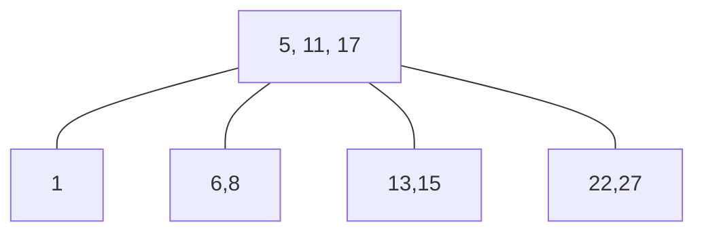
če ima en ključ je: list ali koren
če ima dva ključa:
če ima tri ključe: 
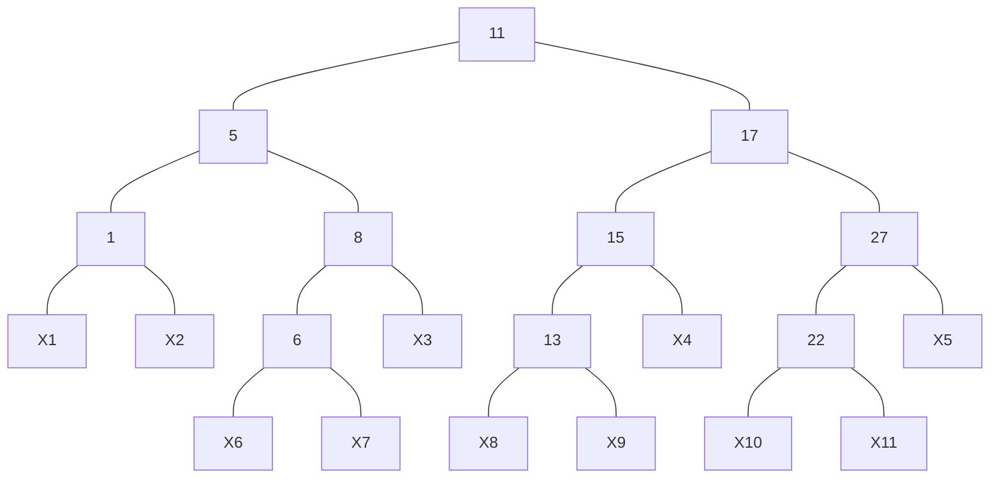

#### Primer: B drevo
vstavimo elemente v B-drevo rda 4 in Č-R drevo
## Rdeče-črna drevesa
ekvivalentna 2,3,4 drevesom. so binarna. iskalna (levo<x<desno), imajo še poleg ključa barvo vozlišča (0,1). če pogledate katerokoli pot od vozlišča do lista bo št. črnih in št rdečih enaka. uravnotežena v smislu črno-rdeče. koren je vedno **Črn**, listi so vedno **črni in brez informacij.** vsakemu rdečemu vozlišču mora slediti črno.

#### Primer: B drevo
vstavimo elemente v B-drevo rda 4 in Č-R drevo
elemente: 4,7,12,15,3,5,14
prvi element vstavimo kot črno, drugače kot rdeče.
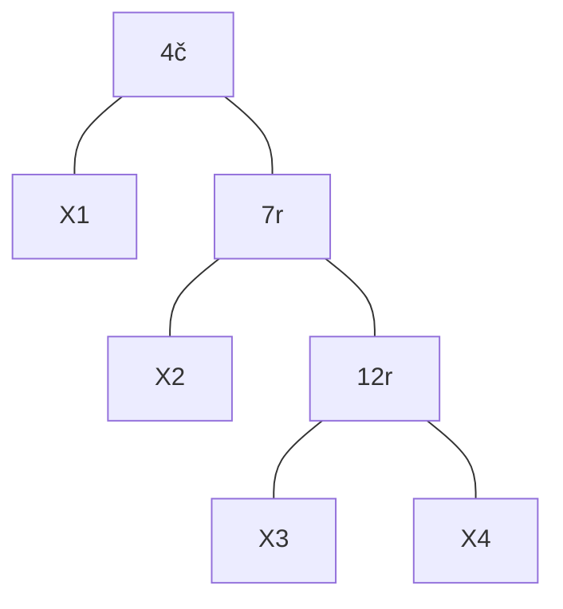
nardimo rotacijo
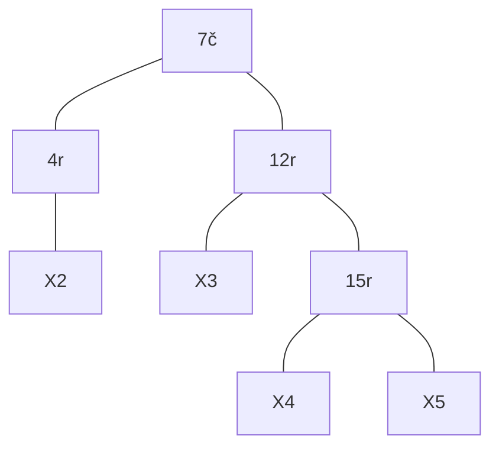
Prebarvamo:
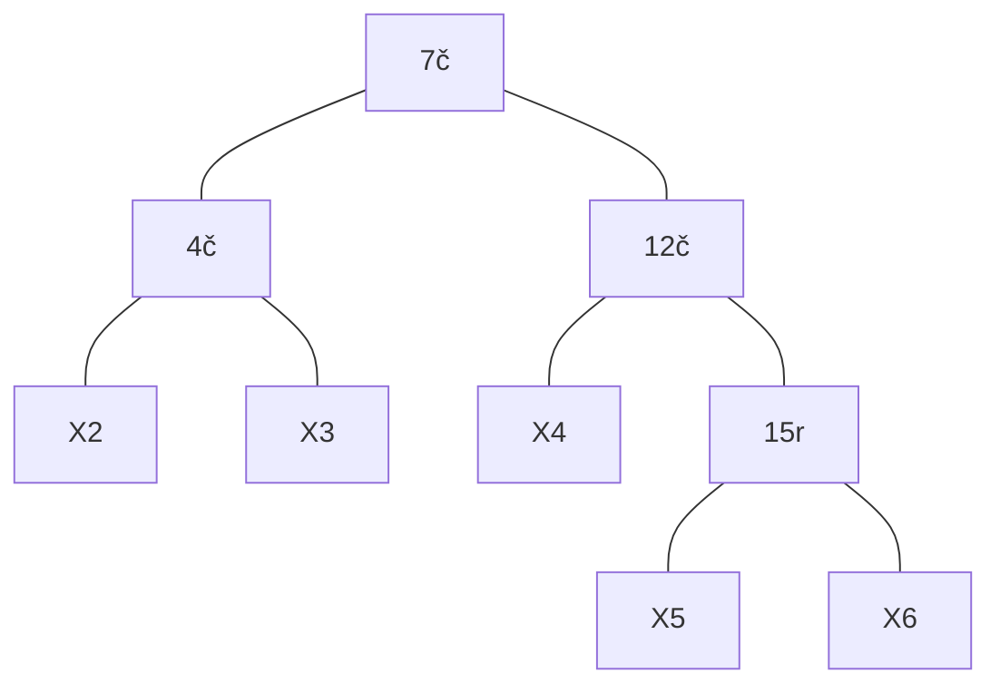
Vstavimo 3,
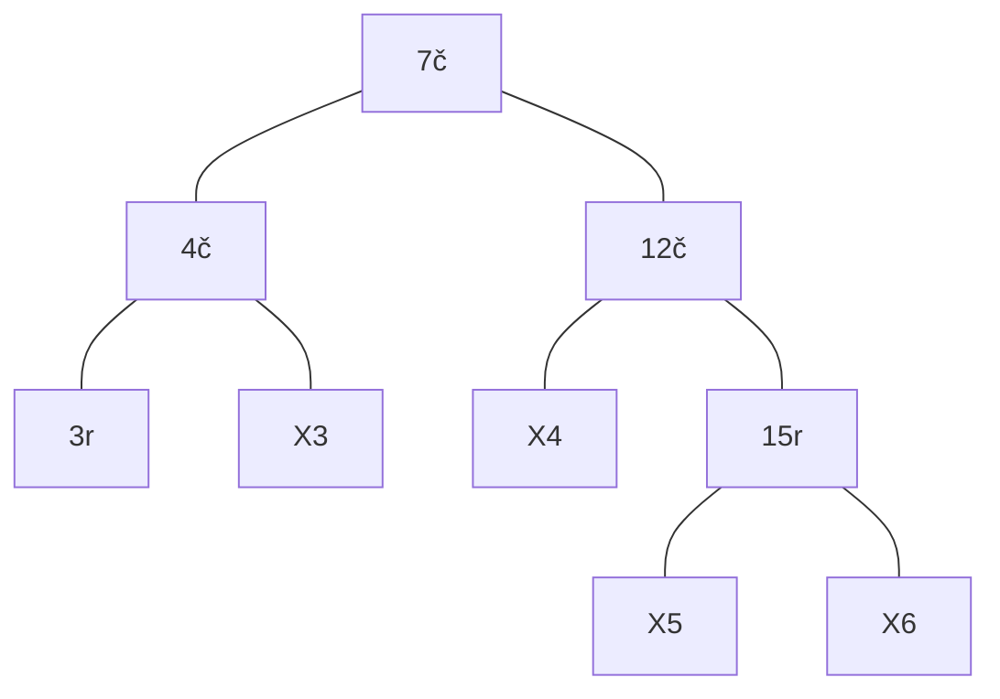
Vstavimo 5;
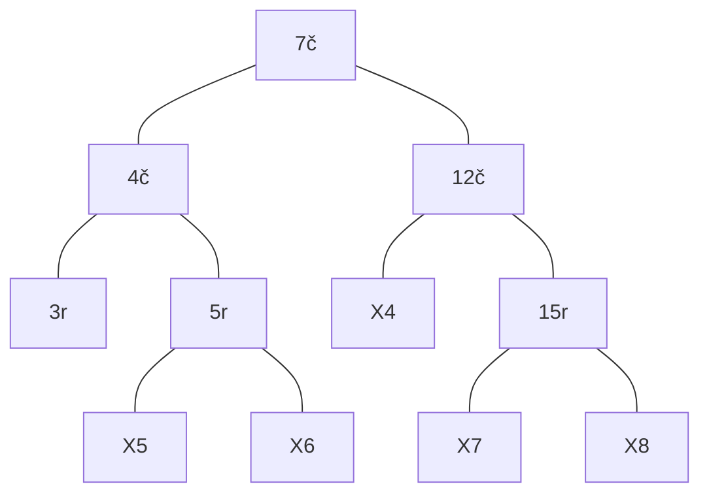
Vstavimo 14
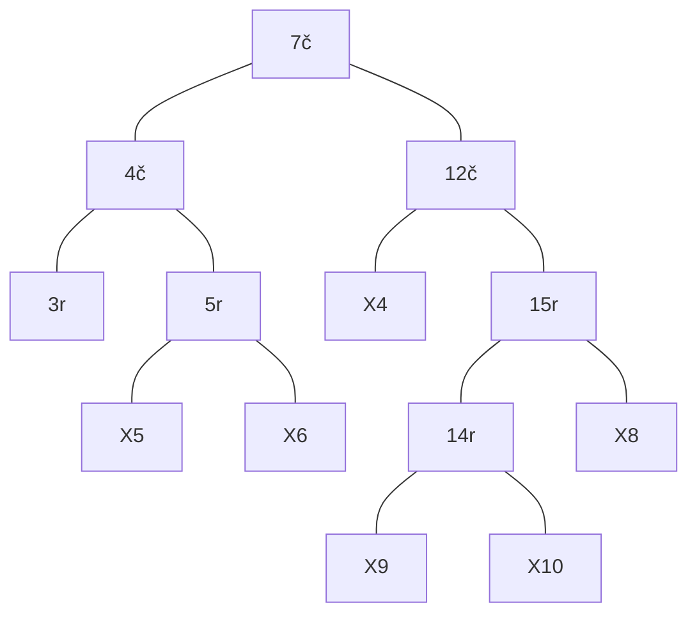
obrnemo:
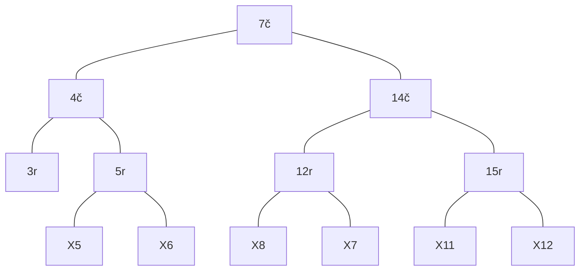