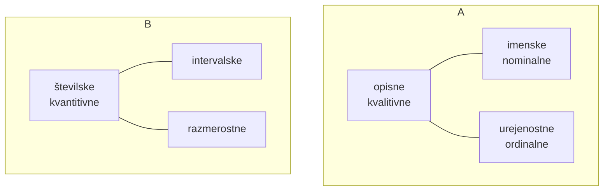

# Spremenljivke

# Strukture
## Frekvenca
$$f_i=\#(X)$$ v neki skupini ali frekvenca enote X za opisne.
## Relativna frekvenca
$$f_i°=\frac{f_i}{\sum_{i=1}^{K}f_i}$$
v odstotkih:$$f_i\%=100*\frac{f_i}{\sum_{i=1}^{K}f_i}$$
za njih uporabimo **hitogram** ali **tortni diagram**
## Komulativna frekvenca
$$F_j=\#(X\le a_j)$$ sum prejšnih razredov
## Relatvina komulativna frekvenca
$$F_j\%=100*\frac{F_j}{\sum_{i=1}^{K}f_j}$$
lahko prikažemo z **ogivo** ali poligonom
## Tabela
dodamo spodnjo in zgornjo mejo, da je zgornja prejšnega = spodnji naslednjega
$x_{i,max}=x_{i+1,min}$
**d** = širina razeda
$g_i=\frac{f_j}{d_i}$ gostota razreda
$x_i=\frac{x_{i,max}+x_{i+1,min}}{2}$ sredina razreda
## Ranžirna vrsta
določimo jih lahko tudi frekvencam

$$x_1\le x_2\le ... \le x_n$$
elementi $x_i$ so **Vrstilne statistike**
### Rang
je položaj vrednosti po vrsti $R(x)=n, n+1,...$
#### Vezani rang
če ima vrednost več rangov ji določimo **vezani rang** $$R(x)=\frac{min(R(x))+MAX(R(x))}{2}$$
#### Kvartilni rang
$$r(x)=\frac{R(x)-\frac{1}{2}}{n}$$
## Kvantili
### Mediana
$$Me=Q_{0.5}=$$