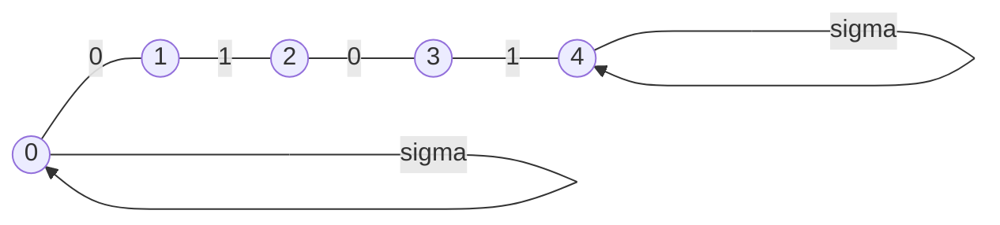

Determinizem proti nedeterminizmu je enako kot:
Konstrukcija rešitve proti preverjanju rešitve.

Det | NeDet $\approx$ Konstrukcija | preverjanje rešitve

# abeceda
$\Sigma = \{0,1\}$
iz črk $\Sigma$ lahko tvorimo besede:
- $$\{0,1,00,01,...,\epsilon,...\}=\Sigma^*$$
- $L\subseteq \Sigma^*$ -Jezik
- $$\begin{align}
\Sigma =\{A,G,C,T\}:L_1=\{\omega|\omega\ človeški\ genom\}\\
L_2=\{\omega|\omega\ človeški\ genom\}\cap L_1,
\end{align}$$
- imamo $$\begin{align}
\omega_x \in \Sigma^*,L_y:\\
ali\ je\ \omega_x\in L_y?
\end{align}$$
Jezik:
- primer jezika:
$$\begin{align}
L_0=\{\omega|\omega\ sestoji\ samo\ iz\ 0\}\\
\omega=0^*
\end{align}$$
- postopek, ki preveri: $\omega_x\in L_0:$
```
Preveri(L_0,w):
	stanje="je v L0"
	n=|w|
	for i=1...n:
		a=w[i]
		a=read()
		if a = "1":
			stanje="ni v L0"
	if a == "je v L0":
		return TRUE
	else
		return FALSE
```
## DKA

![[20220223_131554.jpg]]

|                | 0              | 1              |
| -------------- | -------------- | -------------- |
| $\underline 0$ | $\underline 0$ | $\underline 1$ |
| $\underline 1$ | $\underline 1$ | $\underline 1$ |
$Def: \ Preveri(\delta,F,\omega):$
```
q=0, n=|w|
for i=1...n:
	a=w[i]
	q = delta[q,a]
if q in F:
	return TRUE
else
	return FALSE
```
EOF -> End of file


## Nedeterministični KA -> NKA
$$\begin{flalign}
Def:\\
L_{0101}=\{\omega | \omega\ vsebuje\ niz\ 0101\}
\end{flalign}$$

^be08fd



|  $\delta$   | 0   | 1   |
| --- | --- | --- |
| 0   | 1,0 | 0   |
| 1   | -   | 2   |
| 2   | 3   | -   |
| 3   | -   | 4   |
| 4   | 4   | 4   |

^e503f5

ker gremo lahko pri $(0,0)$[[#^e503f5|primer]] v dve stanji (1 ali 0) pravimo **Determinizem**
$Primer:$
$$\begin{align}
11110101111\\
00000123444\\
\\
11100101111\\
Mi:\  00001\ \ \ \ \ \ \ \ \ \ \ \ \\
Rač:\ 00000123444\\
\end{align}$$

$Def:vsebuje(\delta,F,\omega):$
```
q=0; n= |w|
for i=1...n:
	a=w[i]
	q = NEDET_delta[q,a]
if q in F:
	return TRUE
else
	return FALSE
```

^2f9fb5

$O(n)=T_{KA}(n)$
v praksi tega ne moremo sprogramirati.
Pri nedeterminističnem stroju/algoritmu, želimo dobiti poleg odgovora še dokaz/certifikat.

konkretno v primeru [[#^be08fd|L_0101]]  je dokazilo:
- mesto kjer se nahaja 0101
- v splošnem : Zaporedje stanj
v [[#^2f9fb5|vsebuje]] dodamo še dok="0" na 1, pri 4|5 vstavimo dok= CONTAT(dok,q) in vrnemo poleg TRUE/FALSE še dok

$Preveri(w,L):$
```
<sigma,F>=Create(L)
```
DET:
```
r=Vsebuje_0(sigma,F,w)
```
NEDET:
```
<r,d>=Vsebuje_r(sigma,F,w)
if !Pravilno(sigma,F,w,d,r):
	ERROR
```
END:
```
return r
```
### Det:
$$\begin{align}
T_0(n)=T_{create}(|opis|)+T_{vsebuje_0}(n)
\end{align}$$

### NeDet:
$$\begin{align}
T_n(n)=T_{create}(|opisL|)+T_{vsebuje_{n}(n)+}T_{pravilno}(n)
\end{align}$$


$L_{nnn}=\{\omega|\omega=0^n1^n0^n\}$ -> jezik za katerega ne obstaja KA


$$\begin{align}

&L_{KA}=\{\omega|\omega\ je\ regularni\ izraz\}\\
\\
&RI: 0,1,\epsilon\\
&\omega=\omega_1*\omega_{2},\omega_{1}\ in\ \omega_{2}\ sta\ RI\\
\\
&-010010*101010;\omega_{0101}*\omega_{0}\\
&- \omega-reg.izraz:\omega^{*}\ je RI:(0101)^*=>L_{(0101)^*}=\{\epsilon,0101,01010101,010101010101,...\}
\end{align}$$
### Zahtevnost problema 
- za vsak jezik, katerega besede so popisljive z RI =>$\exists$ DNK
- $\exists$ jezik $L_{nnn}$, za katerega ni KA
	- => želimo KA dodati pomnilnik
	- Turingov stroj(kot končni avtomat, vendar lahko na trak tudi piše -> mi bomo uporabljali RAM)
### Praktičnost Rešitve
Rešitev je praktična, če jo dobimo v doglednem času.
- Primer Hanojskih stolpi
	- REŠITEV zahteva $O(2^n)$ premikov
- rešitev je **praktična** če ima zahtevnost $O(n^k)$ \[ polinomsko \]

#### Primer
imamo graf $G=(V,E);\ |V|=n,|E|=m$
