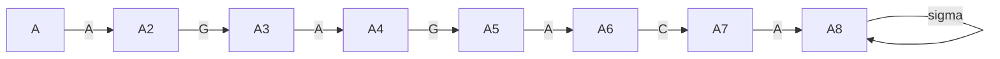
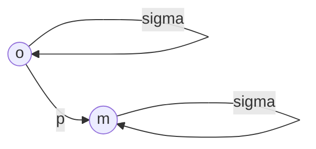

iščemo $p$ v besedilu $t$, kjer sta p in t nek niz.
$|p|=m;|t|=n$

je naivni algoritem:

![[20220302_121353.jpg]]

$p[1,...,m];t[1,...,n]\in \Sigma$

$Def:$ 
Sreda(p,t):
```
Sreda(p,t):
	n=|t|; m=|p|;
	for i=1...n-m:
		j=1
		while(j<=m)&&(t[i+j-1]=p[j]):
			j=j+1
		if j>m:
			r=r*"i";
	return r
```

# Primer
$t=AGAGAGACAGA$
$p=AGA$: 1,3,5,9

```
m=3, n=11, r=[]
i=1
	j=1,2,3,4
r=[1]
i=2
	j=1
i=3
	j=1,2,3,4
r=[1,3]
```

## naivni
algoritem je $O(m(n-m))=O(nm)\to 10^{11}*10^{2}=10^{11}\to$ približno dve minute

## LP
$L_p=\{t|t$ vsebuje p$\}$
lahko upoabimo "končni avtomat" 

$p_2=AGAGACA$

Nad KA, ki razpozna ali je $t\in L_{p}$
- Obstaja postopek, ki poljubni NKA -> DKA. Ta postopek v splošnem potebuje $O(2^{|Q|})$ časa.
- naš $NKA_p$, pa ni splašna NKA, ampak je na nek način specifični:


Imamo niz $s$ in vzorec $p$. Definirajmo $\sigma_p(s)\ \equiv$ dolžina najdalše pripone $s$, ki je predpona $p$  

$$\begin{align}
p=ab:\sigma_{p}(CCC)=0,\\
\sigma_{p}(abab)=2,\\
\sigma_{p}(AAA)=1\\
\end{align}$$
$t=AGAGAGACAGA$
$t(2)=AGAGAGACA$
$t(k)=t_{1}t_{2}t_{3}...t_{n-k}$

$p=AGAGA$

```
i=5, j=4

```
$$\begin{align}
p=AGAGAGA&\color{red}{C}AGA\\
AGA&\color{red}{G}A
\end{align}$$
$s=t(8);\sigma_{p}(s)=0\to$ 
$i=(i+j-1)+1; j=1=\sigma_{p}(s)+1\equiv$ Premik $p$-ja za $j$ mest.

$IDEJA:$ naračunajmo $\sigma_{p}(s)$

## Računanje $\sigma_{p}(s)$:
$$\begin{align}
&&t=...\square\square i&\square\square\square j\square...\\
&&p=i&\square\square\square j\square...\\
\\

\end{align}$$
$\Rightarrow s=\alpha p[1...j-1]$, potem $\sigma_{p}(s)\equiv \sigma_{p}(p(j-1)\alpha)$
$\color{red}\Rightarrow \sigma_{p}(s)$ lahko naračunamo brez poznavanja $t$

$Pomen:$ $\sigma_{p}()$

$$\begin{align}

\end{align}$$