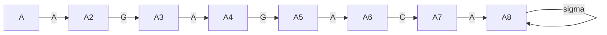
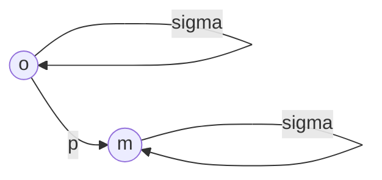
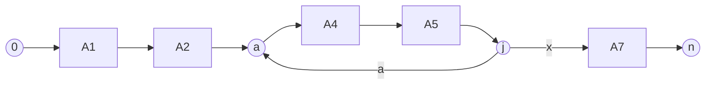

iščemo $p$ v besedilu $t$, kjer sta p in t nek niz.
$|p|=m;|t|=n$

je naivni algoritem:

![[20220302_121353.jpg]]

$p[1,...,m];t[1,...,n]\in \Sigma$

$Def:$ 
Sreda(p,t):
```
Sreda(p,t):
	n=|t|; m=|p|;
	for i=1...n-m:
		j=1
		while(j<=m)&&(t[i+j-1]=p[j]):
			j=j+1
		if j>m:
			r=r*"i";
	return r
```
# Vzorec je dan besedilo se spreminja
## Primer
$t=AGAGAGACAGA$
$p=AGA$: 1,3,5,9

```
m=3, n=11, r=[]
i=1
	j=1,2,3,4
r=[1]
i=2
	j=1
i=3
	j=1,2,3,4
r=[1,3]
```

## naivni
algoritem je $O(m(n-m))=O(nm)\to 10^{11}*10^{2}=10^{11}\to$ približno dve minute

## LP
$L_p=\{t|t$ vsebuje p$\}$
lahko upoabimo "končni avtomat" 

$p_2=AGAGACA$

Nad KA, ki razpozna ali je $t\in L_{p}$
### 1
Obstaja postopek, ki poljubni NKA -> DKA. Ta postopek v splošnem potebuje $O(2^{|Q|})$ časa.
### 2
naš $NKA_p$, pa ni splašna NKA, ampak je na nek način specifični:


Imamo niz $s$ in vzorec $p$. Definirajmo $\sigma_p(s)\ \equiv$ dolžina najdalše pripone $s$, ki je predpona $p$  

$$\begin{align}
p=ab:\sigma_{p}(CCC)=0,\\
\sigma_{p}(abab)=2,\\
\sigma_{p}(AAA)=1\\
\end{align}$$
$t=AGAGAGACAGA$
$t(2)=AGAGAGACA$
$t(k)=t_{1}t_{2}t_{3}...t_{n-k}$

$p=AGAGA$

```
i=5, j=4

```
$$\begin{align}
p=AGAGAGA&\color{red}{C}AGA\\
AGA&\color{red}{G}A
\end{align}$$
$s=t(8);\sigma_{p}(s)=0\to$ 
$i=(i+j-1)+1; j=1=\sigma_{p}(s)+1\equiv$ Premik $p$-ja za $j$ mest.

$IDEJA:$ naračunajmo $\sigma_{p}(s)$

## Računanje $\sigma_{p}(s)$:
$$\begin{align}
&&t=...\square\square i&\square\square\square j\color{red}{a}\square...\\
&&p=i&\square\square\square j\color{red}{x}\square...\\
\\

\end{align}$$
$\Rightarrow s=\alpha p[1...j-1]$, potem $\sigma_{p}(s)\equiv \sigma_{p}(p(j-1)a)$
$\color{red}\Rightarrow \sigma_{p}(s)$ lahko naračunamo brez poznavanja $t$

$Pomen:$ $\sigma_{p}(p(i)*a)$:



Omogoča $d$ pretvorbo $NKA_{p}to DKA(Q,\sum , F, \sigma, Q_0)$
```
def Sreda(p,t):
	n=|t|; m=|p|
	sigma=construct(p)
	Q=0; r=[]
	for i=1...n:
		if Q=m:
			r=r*"i-Q+1"
		Q=sigma[Q,t[i]]
	return r
```

KA:$O(T_{c}+n)$ ^d62195


| $\sigma$ |     | A   | C   | G   | T   |
| -------- | --- | --- | --- | --- | --- |
|          | 0   | 1   |     |     |     |
|          | 1   |     |     | 2   |     |
|          | 2   | 3   |     |     |     |
|          | 3   |     |     | 4   |     |
|          | 4   | 5   |     |     |     |
|          | 5   |     | 6   |     |     |
|          | 6   | 7   |     |     |     |
|          | 7   |     |     |     |     |


```
def ConstructSigma(p):
	m=|p|
	for Q=0...m:
		for a \in Sum:
			k=min(m+1,Q+2)
			Repeat
				k=k-1
			until p(Q)*a je p(k) pripona
			sigma[Q,a]=k
		return sigma
```
[[#^d62195|->]]$O(m*|\sum|*m*m)=O(m^3*|\sum|)\to 10^9+10^6*10=10^9+\epsilon$
ko je delta naračunana lahko iščemo v poljubnem $t$


$q=0:p(q)=\epsilon$

$$\begin{align}
p(q)a=&A\to\sigma_{p}(A):k=2;k=1:Ali\ je\ A\ pripona\ A\\
&\to\sigma_{p}(C):k=2;k=1:Ali\ je\ A\ pripona\ C\to k=0:Ali\ je\ \epsilon\ pripona\ C\\
&\to\sigma_{p}(G)\\
&\to\sigma_{p}(T)\\
\end{align}$$

$$\begin{align}
q=1:&p(q)=A\\
&p(q)*a=&&AA=k=1\\
&&&AC = 0\\
&&&AG=2\\
&&&AT=0\\
\end{align}$$


![[20220302_135143.jpg]]

$\pi[q]\to q$ 

$KNP$ (Knuth-Morris-Pratt) algoritem
```
def Sreda(p,t):
	n=|t|; m=|p|;
	PI=ConstructPI(p);
	r=[];Q=0;
	for i=1...n:
		while Q>0 && (p[Q+1]!=t[i])
			Q=PI[Q]
		if p[Q+1]=t[i]:
			Q=Q+1
		if Q=m:
			r=r*"i-Q+1"
```

Amortizacija-

Amortizirano je $O(n)$

### 3

```
def ConstructPI(p):
	m=|p|
	PI[1]=0
	k=0
	for Q=2...m:
		while (k>0)&& (p[k+1]!=p[q]):
			k=PI[k]
		if (p[k+1]=p[q]):
			k=k+1
		PI[q]=k
	return PI
```

$T_c:O(m)\to 10^9+10^2$


# Besedilo je dano, vzorec se spreminja
#### Doslej je veljalo: 
- $\Omega(n)$, ker moramo $t$ vsaj prebrati za samoiskanje.
- poleg tega smo porabili $T_{c}(m)=\Omega(m)$ časa za **Predprocesiranje**  

#### Poslej želimo:
- $\Omega(m)$ za iskanje, ker moramo $p$ vsaj prebrati
- poleg tega $\Omega(n)$ za **Predrpocesiranje** $t$.

## Podatkovna struktura
- Številska drevesa (trie): Številsko drevo omogoča iskanje vzorca v besedilu $t$, če je le-ta predpona $t$.

$t=AGAGAGACAGA\ ; \sum=\{A,G,C,T\} \color{red}\to\{A,C,G,T,€\}$

€ (\$)uporabimo na koncu pripon da vemo da so to pripone.

$$\begin{align}
&p_{1}=AGAG\\
&p_{2}=CC\\
&p_{3}=GAG
\end{align}$$
AGAGAGACAGA
$$\begin{align}
0\ &AGAGAGACAGA€\\
1\ &GAGAGACAGA€\\
2\ &AGAGACAGA€\\
3\ &GAGACAGA€\\
4\ &AGACAGA€\\
5\ &GACAGA€\\
6\ &ACAGA€\\
7\ &CAGA€\\
8\ &AGA€\\
9\ &GA€\\
10\ &A€\\
11\ &
\end{align}$$
**Tako nastane PRIPONSKO DREVO**

ko najdemo vzorec ki je enak, mu še dodamo link na najbližji levi in desni list. tako dobimo povezan seznam:

11-10-6-8-4-2-0-7-9-5-3-1

# povzetek
začel z naivnim
sli do avtomatov-> sigme se znebil -> postane konstantno
prišli do KMP, kjer je $\pi$ ze naračunan za odseke nazaj, primerjave delamo za $k$ kjer je ta največ $q$. 


$$\begin{align}

\end{align}$$