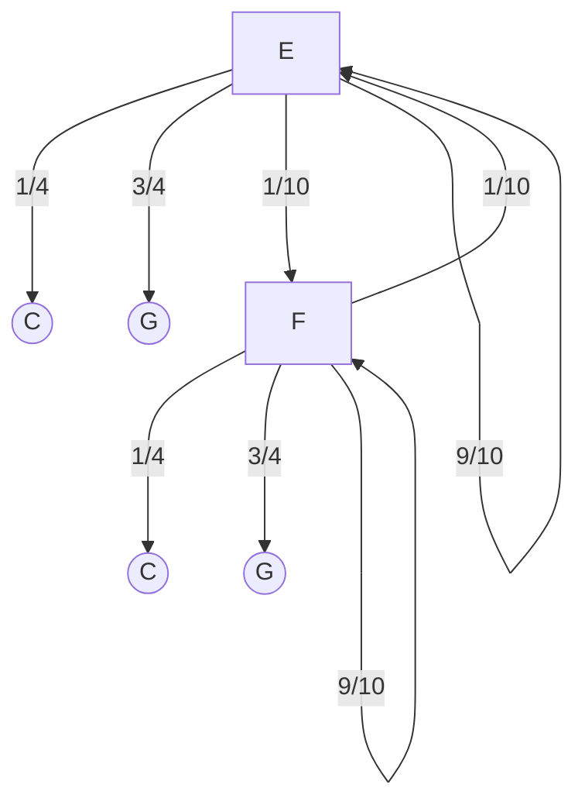

Imamo besedilo $t:ATGCATACATCG$ in vzorec $p: AGAGACA$. ali obstaja $d(t[i...j],p)\le k$ 
> $T_{L}(n,m)=O(n*m)$ -> $d_{L}$ računamo poredko in na majhnem $n,m$
> $T_{M}(n,m)=O(n+m)$

-> Ideja rešitve :
- iz vprašanja $t$ izločimo/ zmanjšamo problem iz problema (kandidati) in 
- nato $d_{L}$ 

$$\begin{matrix}
&A&G&A&A&C&A\\
A&*& & *&*& &*\\
T& & & & & & \\
G& & & & & & \\
C& & & & & &\\
A& & & & & &\\
T& & & & & &\\
A& & & & & &\\
C&&&&&&\\
A&&&&&&\\
T&&&&&&\\
C&&&&&&\\
G&&&&&&\\
\end{matrix}$$
![[20220316_124730.jpg]]
**Časovna zahtevnost:** 
- velikost matrike je $n*m$
	- za vpis $*$ potrebujemo $O(n*m)$
- število diagonal je $n+m$
	- na vrednosti diagonal vplivajo samo $*$ 
	- -> če pogledamo stvar potrebujemo samo pregledati število pik 
		- -> $O(\#*=\textcolor{green}{\pi})$
Želimo algoritem ki ima časovno zahtevnost $O(\pi)$ in prostorsko zahtevnost $O(n+m)$
za vsako diagonalo $l$ imamo števec, ki jih ustrezno za vsako $*$ povečamo.

- $d[l]:-n\le l\le m$
- $\forall c \in \Sigma$  imamo seznam indeksov, kjer se $c$ pojavi v $t$:
> $$\begin{align}
u[A]:1,5,7,9\\
u[C]:\\
u[G]:\\
u[T]:\\
\end{align}$$

```
for i=1...m:
	c=p[i]
	povečamo d[l],kjer je l izračunan in u[c] in i
poiščemo najpop. diagonalo
```

$$\begin{align}
&3:&AGAGACA\\
&&ATGCA\\
\\
&3:&AGAGACA\\
&&ATGCATA
\end{align}$$

Namesto ujemanja **posamznih črk**, iščemo ujemanje $k$-teric.

## 2 
$p=AGAGACA$
$t_{1}=ATGAGCACATT$
$t_{2}=GATATACATT$


## algoritem FASTA
[[slika]]
![[20220316_124746.jpg]]
rešuje vstavljanje presledka


# 3 če primerjamo
$ATGCATACA...$
$p:AGCCTT$

$$\begin{align}
AT&&G&&C&&A&&T&&A&CA...\\
&&|&&|&&ł&&|\\
p:A&&G&&C&&C&&T&&T\\
\end{align}$$
Ali lahko najdemo $k$-terico, kjer je 1 napaka v ujemanju?

$$\begin{matrix}
 &A&G&C&C&T&T\\
A&+& & & & & \\
T& & & & &+&+\\
G& &+& & & &\\
C& & &+&+& &\\
A&+& & & & &\\
T& & & & &+&+\\
A&+& & & & &\\
C& & &+&+& &\\
A&+& & & & &\\
\end{matrix}$$
![[20220316_130241.jpg]]
```
vzamemo c=p[i...k-1]
for c':d(c',c)\le f
	c=GCCT:
	c'\in{GCCT,ACCT,
		  CCCT,TCCT,
		  GACT,GGCT,
		  CTCT,...,GCAT,...}
```

# Segmentacija genoma na dele
Dinukleotid $CG$ je v genomu manj pogost, razen v določenih delih.
Kje v genomu je takšen del?
vprašanje **Goljufiva Igralnica**:
- V igralncii mečejo kovanec
- igralci lahko stavijo na cifro(C) ali grb(G)
- če je kovanec ki ga mečem pravičen (E), potem je $p_{E}(C)=p_{E}(G)$
- poleg tega ima pokvarjen kovanec (F), za katerega velja:
	- $p_{F}(C)=\frac{1}{4};p_{F}(G)=\frac{3}{4}$
- kovanca občasno zamenjajo.
- naredijo zamenjavo z verjetnostjo $\frac{1}{10}$

naj $\Pi=\pi_{1},\pi_{2},...,\pi_{n}:\pi_{i}=E/F$ 
$M=m_{1},m_{2},...,m_{n}:m_i=C/G$ 
$v:CGCGGGCGCCG$
$$\begin{align}
v:&CGCGGGCGCCG\\
\pi:&EEEFFFFFEEE\\
p(v)=&\frac{1}{2}\frac{1}{2}\frac{1}{2}\frac{3}{4}\frac{3}{4}\frac{3}{4}\frac{1}{4}\frac{3}{4}\frac{1}{2}\frac{1}{2}\frac{1}{2}\\
&\frac{9}{10}
\end{align}$$
kakšna je verjetnost da je zgornja napoved točna?
- Verjetnost, da smo dobili $v$, če imamo $\pi$ je :
	- $\frac{1}{2}* \frac{9}{10}* \frac{1}{2}* ...$
- v primeru da je vedno bil pravičen (E)
	- $\frac{1}{2}^{11}* \frac{9}{10}^{10}$
- v primeru da je vedno napačen (F)
	- $\frac{1}{4}^{5}* \frac{3}{4}^{6} * \frac{9}{10}^{10}$
- ostale permutacije...
Časovna zahtevnost: $O(2^n*n)$

## Skriti model Markov




![[20220316_135549.jpg]]

$$\begin{align}
p_{n}(E)=
	\begin{cases}
	max(&\frac{1}{2}* \frac{1}{4},\\& \frac{1}{2}* \frac{1}{2}) & \quad \text{n=1}\\
	
	max(&p_{n-1}(F)* \frac{1}{10}* \frac{1}{2},\\&p_{n-1}(E)* \frac{9}{10}* \frac{1}{2}) & \quad \text{n>1}\\
	\end{cases}
\end{align}$$

**pomnenje** -> dinamično programiranje -> Viterbijev algoritem 

če beležimo katerega izbira (RD ali ZE) je doko večjo vrednost, lahko za dani $v$ rekonstrukoriramo $\pi$ 

ker je log monotono naraščajoča, veljam da je max produktovi "enak" max logaritmov produktov -> z logaritmi 