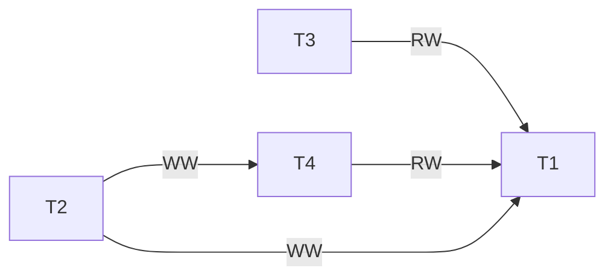
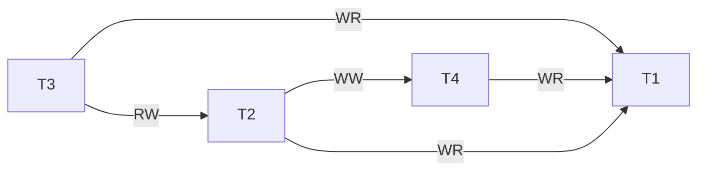
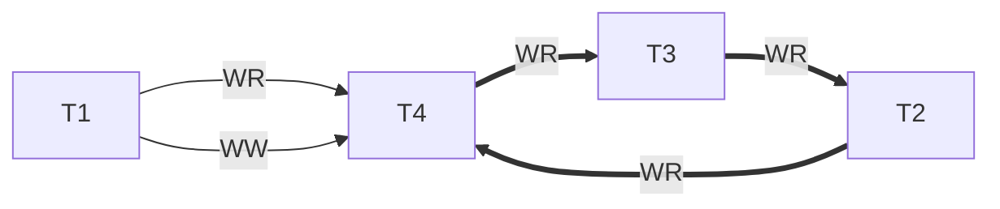

# Naloga 1 - Konflikti transakcij
podana sta razporedja transakcij:

**S1**

| Časovni zaznamek(TS) | 0    | 1    | 2    | 3    | 4    | 5    | 6    |
| -------------------- | ---- | ---- | ---- | ---- | ---- | ---- | ---- |
| T1                   | R(A) | R(B) | W(B) |      |      |      |      |
| T2                   |      |      |      | R(B) | R(A) | W(B) | W(A) | 

**S2**

| Časovni zaznamek(TS) | 0    | 1    | 2    | 3    | 4    | 5    | 6    | 7    | 8    | 
| -------------------- | ---- | ---- | ---- | ---- | ---- | ---- | ---- | ---- | ---- |
| T1                   | R(B) |      |      |      |      | R(A) |      | R(B) | W(B) |
| T2                   |      | R(A) | W(B) | W(A) |      |      |      |      |      |
| T3                   |      |      |      |      | R(B) |      | W(A) |      |      |


## a) Za VSAK razpored (S1 in S2) določite vse konfliktne pare.
npr: Par akcij, ki privede do pisalno-pisalnega konflikta med transkacijama (Tx in Ty) nad objektom Z navedemo kot $(W_x(Z),W_y(Z))$.
### S1

### S2
$(W_1(2),W_2(2))$

## b) Ali je pri drugem razporedu (S2) podan kakšen slepi zapis (Blind Write)? <br>Na Katerem časovnem zaznamku oziroma zaznamkih(Time stamp - TS)?

Da, na 2 in 6.


## c) Za VSAK razpored (S1 in S2) pokažite kako bi se izognili konfliktom z uporabno striktnega dvo-faznega zaklepanja (Strict Two-Phase Locking (Strict 2PL))
- Deljene in eksluzivne zaklepe uporabite razumno. Predpostavite, da vnaprej vemo katere operacije bodo bile izvedene nad določenem objektom. 
- Vključite čakalne grafe za zaznavo smrtnih objemov.
- V primeru smrtnega objema upoštevajte politiko Rani-Čakaj. Prednost se določi glede na časovne zaznamke (npr. TS1 < TS2 < TS3 < ... < TSX); kjer ima transakcija z TS1 najvišjo prioriteto, medtem ko ima transakcija s TSX najmanjšo prioriteto).  
**Zapišite vsa opažanja.**

### S1
Čakalni graf: T1->T2

| TS  | 0    | 1    | 2    | 3    | 4    | 5     | 6   | 7    | 8    | 9    | 10   | 11   | 12   | 13  |
| --- | ---- | ---- | ---- | ---- | ---- | ----- | --- | ---- | ---- | ---- | ---- | ---- | ---- | --- |
| T1  | S(A) | R(A) | X(B) | R(B) | W(B) |       | C   |      |      |      |      |      |      |     |
| T2  |      |      |      |      |      | !X(B) |     | X(B) | R(B) | X(A) | R(A) | W(B) | W(A) | C   |


### S2

| TS  | 0   | 1    | 2    | 3   | 4    | 5    | 6     | 7              | 8   | 9     | 10             |
| --- | --- | ---- | ---- | --- | ---- | ---- | ----- | -------------- | --- | ----- | -------------- |
| T1  | TS1 | X(B) | R(B) |     |      |      |       |                |     |       |                |
| T2  |     |      |      | TS2 | X(A) | R(A) | !X(B) | Čakaj(TS1<TS2) |     |       |                |
| T3  |     |      |      |     |      |      |       |                | TS3 | !S(B) | Čakaj(TS1<TS3) | 


| TS  | 11    | 12               | 13   | 14   | 15   | 16   | 17  | 18   | 19   | 20   | 21   |
| --- | ----- | ---------------- | ---- | ---- | ---- | ---- | --- | ---- | ---- | ---- | ---- |
| T1  | !S(A) |                  | S(A) | R(A) | R(B) | W(B) | C   |      |      |      |      |
| T2  |       | Prekini(TS1<TS2) |      |      |      |      |     | X(A) | R(A) | X(B) | W(B) | 
| T3  |       |                  |      |      |      |      |     |      |      |      |      |


| TS  | 22   | 23  | 24   | 25   | 26   | 27   | 28  | 
| --- | ---- | --- | ---- | ---- | ---- | ---- | --- |
| T1  |      |     |      |      |      |      |     |
| T2  | W(A) | C   |      |      |      |      |     |
| T3  |      |     | S(B) | R(B) | X(A) | W(A) | C   |


# Naloga 2 - Konsistentnost podatkovne baze
Objekta A in B imata začetni vrednosti nastavljeni na 150. Konsistentnost podatkovne baze se ohrani ko je seštevek obeh objektov enak pred in po izvedbi obeh transakcij.

<table>
    <tr>
        <td>Transakcija 1(T1)</td>
        <td>Transakcija 2(T2)</td>
    </tr>
    <tr>
        <td><table>
    <tr>
        <td>R(A)</td>
    </tr>
    <tr>
        <td>A=A-50</td>
    </tr>
    <tr>
        <td>R(B)</td>
    </tr>
    <tr>
        <td>W(A)</td>
    </tr>
</table>
</td>
        <td><table>
    <tr>
        <td>R(B)</td>
    </tr>
    <tr>
        <td>B=B+50</td>
    </tr>
    <tr>
        <td>R(A)</td>
    </tr>
    <tr>
        <td>W(B)</td>
    </tr>
</table>
</td>
    </tr>
</table>

Poiščite razpored transakcij s vzporednim izvajanjem transakcij, ki bo ohranil konsistentnost baze podatkov.  
- Izogibajte se konfliktom.  
- Predpostavite, da se ne uporablja nobena kontrola vzporednosti.

$A=150;B=150$
ohrani => $A+B=N;preT(N)==postT(N)$


|         | A   | B   |
| ------- | --- | --- |
| začetek | 150 | 150 |
| T1      | 100 | 150 |
| T2      | 100 | 200 | 


|         | A   | B   |
| ------- | --- | --- |
| začetek | 150 | 150 |
| T2      | 150 | 200 |
| T1      | 100 | 200 |

# Naloga 3 - Zaporedna uredljivost po konfliktih
**Ugotovite, ali je kateri od razporedov (S1, S2, S3) zaporedno uredljiv po konfliktih.** 
Kot dokaz priložite grafe odvisnosti.
## a) Razpored 1(S1)

| T1  |      | R(A) |      |      | W(A) |      | W(B) |
| --- | ---- | ---- | ---- | ---- | ---- | ---- | ---- |
| T2  |      |      |      | W(B) |      |      |      |
| T3  | R(A) |      |      |      |      |      |      |
| T4  |      |      | R(A) |      |      | R(B) |      |


> S1 je zaporedno uredljiv:
>> $T2\to T4\to T1$
>> $T3\to T1$
>> $T2\to T1$
>> $T2\to T4$
>> $T4\to T1$


## b) Razpored 2(S2)

| T1  |      |      |      |      |      | R(A) | R(B) |
| --- | ---- | ---- | ---- | ---- | ---- | ---- | ---- |
| T2  |      | W(A) |      |      |      |      |      |
| T3  | R(A) |      |      | W(B) | R(C) |      |      |
| T4  |      |      | W(A) |      |      |      |      |



>S2 je zaporedno uredljiv:
>> $T3\to T2\to T4\to T1$
>> $T3\to T1$
>> $T3\to T2$
>> $T2\to T1$
>> $T2\to T4$
>> $T4\to T1$

## c) Razpored 3(S3)

| T1  | W(A) |      |      |      |      | W(C) |      |      |
| --- | ---- | ---- | ---- | ---- | ---- | ---- | ---- | ---- |
| T2  |      |      |      | W(B) |      |      |      | R(A) |
| T3  |      |      |      |      | R(A) |      | W(A) |      |
| T4  |      | R(A) | W(A) |      |      |      |      |      |


>S3 **NI** zaporedno uredljiv, saj nastane cikel na:
>>T4->T3->T2->T4

## d) Za VSAK razpored, ki je zaporedno uredljiv po konfliktih, zapišite VSE ustrezne zaporedne razporede.
### S1
```mermaid
graph 
```

### S2

### S3
**ni Zaporedno uredljiv**
