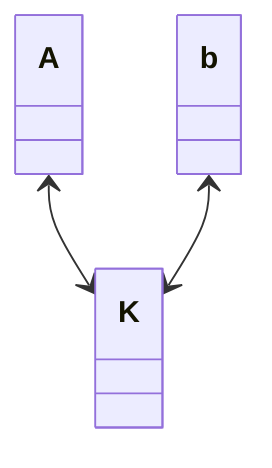

## SUPB
**S**istem za **U**pravljanje s **P**odatkovnimi **B**azami
- velika povezana zbirka podatkov
- modelira okolje v realnem svetu
	- *Entitete* (osebe,studenti,predmeti)
	- *Razmerja* (npr. Tone vpisan na Podatkovno bazo)
- SUPB je programski sistem za shranjevanje podatkov in upravljanje s podatkovnimi bazami
### V primerjavi z Datotekami
Aplikacije prenašajo velike količine podatkov  med dinamičnim spominom in diskom.
**SUPB** zaščiti podatke pred nekonsistenco, ki je lahko posledica večih hkratnih uporabnikov. prav tako ščiti pred izpadom sistema. hkrati pa zagotavlja večjo **varnost** in kontrolo dostopa.
## Podatkovni model
je zbirka konceptualnih gradnikov za opis podatkov. poznamo:

### Relacijski podatkovni model
- Relacija je v osnovi tabela, s stolpci in vrsticami
- vsaka relacija ima shemo, ki opisuje stolpce in vrstice
