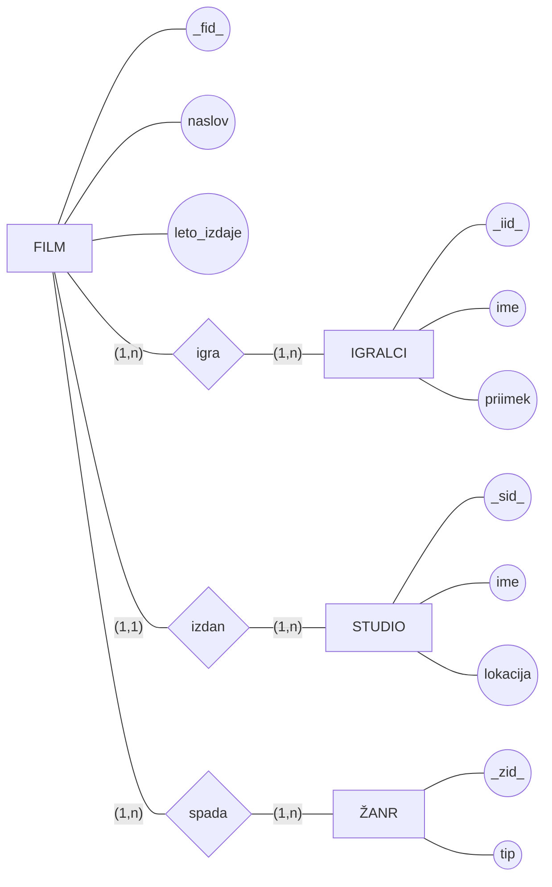

# naloga 2

```mermaid
flowchart LR
A[FILM]
B[STUDIO]
C[IGRALCI]
D[ŽANR]

A---A1((_fid_))
A---A2((naslov))
A---A3((leto_izdaje))

B---B1((_sid_))
B---B2((ime))
B---B3((lokacija))

C---C1((_iid_))
C---C2((ime))
C---C3((priimek))

D---D1((_zid_))
D---D2((tip))

A-- "(1,n)" ---E{igra}-- "(1,n)" ---C
A-- "(1,1)" ---F{izdan}-- "(1,n)" ---B
A-- "(1,n)" ---G{spada}-- "(1,n)" ---D
```

```SQL

```