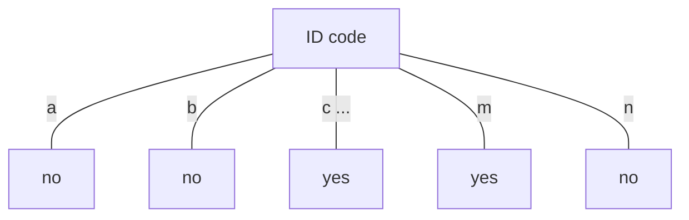

# Odločitvena drevesa
- notranje vozišča predstavljajo atribut
- veja predstavlja rezultat tega testa n.p.r. "color =red"
- list predstavlja oznako razreda(ali porazdelitev vrednosti razreda)
- **v vsakem vozlišču**: en atribut je izbran, po katerem delimo učne primere v kar se da "čiste" podmnožice
- nove primere kasificiramo tako, da sledimo ustreznim potem v drevesu od korena do listov

## Gradnja drevesa
od zgoraj navzdol
- na začetku so vsi primeri v korenu drevesa
- rekurzivno delimo primere v podmnožicce s pomočjo atributov in  njihovih vrednosti.

## Rezanje drevesa
od spodaj navzgor
- odstranimo poddrevesa ali veje drevesa z namenom izboljšati točnost napovedi drevesa na novih primerih

## Izbor atributa za delitev primerov
- **v vsakem vozlišču drevesa:** ocenimo razpoložljive atribute glede na njihovo sposobonost delitve primerov na "čiste" podmnožice - uporabimo **funkcijo primernosti**(goodness function)
- Tipične funkcije:
	- Informacijski prispevek (ID3, C4.5) 
	- Raazmerje informacijskega prispevka (C4.5)
	- Gini indeks (CART)
	---
	najboljši je tisti atribut, ki na koncu priprelje do najmanjšega drevesa.
	_Hevristika_: izberemo atribut, ki razdeli podatke na "najčistejše" podmnožice
	kako merimo čistost? -> **Informacijski prispevek**
	Zberamo atribut z največjim IP
	## Računanje informacije
	IP merimo v **bitih**
	- informacijo ki jo potrebujemo, da lahko napovemo nek dogodek, če poznamo verjetnost porazdelitev "vseh" dogodkov imenujemo **Entropija**
	- entropija poda zahtevano informacijo v bitih(ni nujno celo število)
	> formula za izračun entropije: $$entropija(p_1,p_2,...,p_n)=-p_1\log _2p_1-p_2\log _2p_2 ... -p_n\log _2p_n$$

### zaželjene lasnosti mere "čistosti"
#TODO

>entropija razbitja =0 (vsi listi so čisti, saj vsebujejo le po en primer)
>IP za atribut "ID koda" je maksimalen

| Outlook              | Temperature | Humidity | Windy |
| -------------------- | ----------- | -------- | ----- |
| Info: 0.693  Gain: |             |          |       |

