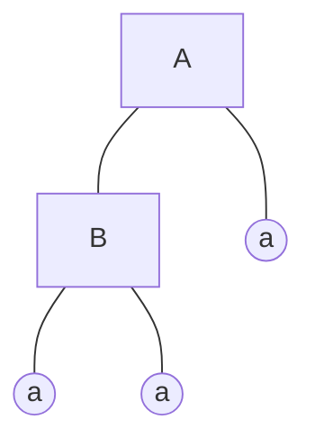

odločitvena/klasiikacijska pravila

ko beremo dobimo toliko pravil kot je listov.  

```ad-note
collapse: true
title: Primer:
gradnja pravila:

> if true then class = a
> if x > 1.2 then class = a
> if x > 1.2 and y > 2.6 then class = a

> možna pravila za množico b
>> if x$\le$

```

# Prekrivni algoritem
