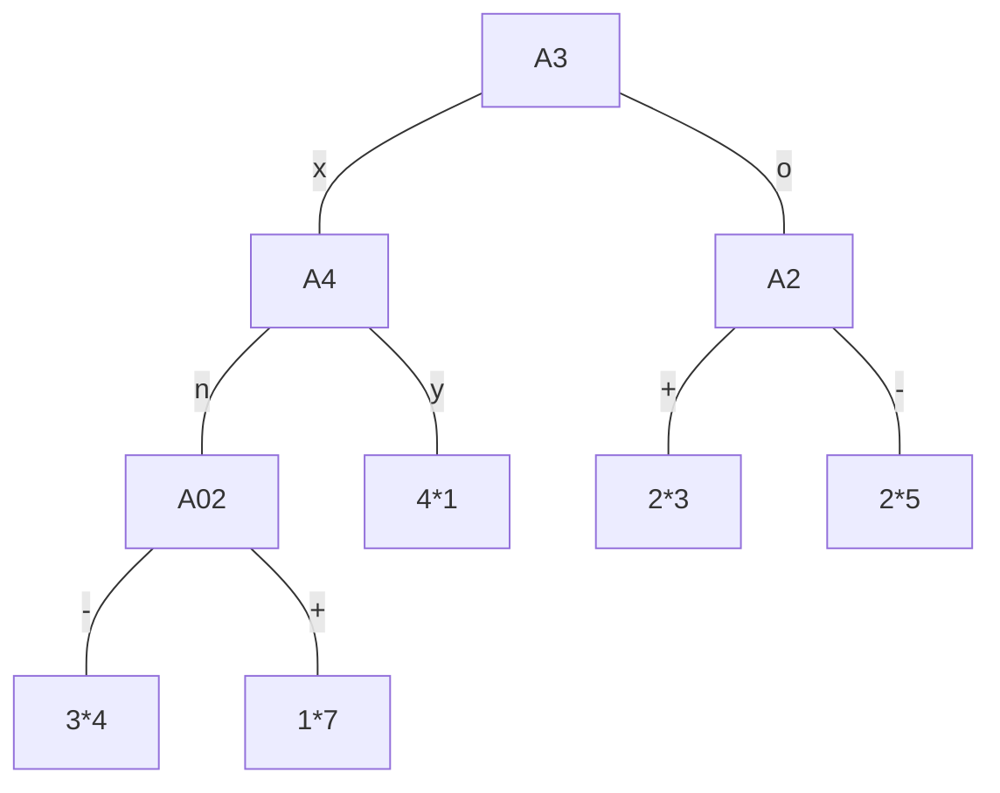

| ID  | A1      | A2  | A3  | A4  | R   |
| --- | ------- | --- | --- | --- | --- |
| 100 | 2000,00 | -   | o   | y   | Da  |
| 101 | 2006        |     |     |     |     |

# 1 naloga
odločitvena drevesa

200:
>$p(DA)=\frac{2}{7}=0.29$
>$p(NE)=\frac{5}{7}=0.71$

202:
>$p(DA)=\frac{\frac{\frac{\frac{8}{15}1}{8}+7}{15}3}{7}=\frac{4}{15}$

201:
>$p(DA)=(\frac{5}{20})*\frac{6}{5}+ \frac{15}{20}* \frac{1}{8}= \frac{47}{160}=0.29$
>$p(NE)= \frac{5}{20} \frac{1}{5}+ \frac{15}{20} \frac{7}{8}=0.71$

# 2 naloga
odločitvena pravila
```
if(A2==+) and (A3== o) and (A4 == y) then: NE
```
najdimo drugo pravilo:
(prism dela po vrsti, drugo pravilo bo pol po tem kar ni blo z tem dobljen)
v tem primeru odčrtamo 110 stran ker ga pokriva

računamo p/t (pokriti proti nepokritim) 

| A2     | +   | 2/5  |                 |
| ------ | --- | ---- | --------------- |
| A2     | -   | 3/5  |                 |
| A3     | o   | 2/5  |                 |
| A3     | x   | 3/5  |                 |
| A4     | y   | 1/3  |                 |
| A4     | n   | 3/7  | TA JE NAJBOLJŠI |
| skupaj | --- | 4/10 |                 |

```
if(A4 == n) and 
```

 | A2     | +   | 2/5 |
 | ------ | --- | --- |
 | A2     | -   | 1/2 |
 | A3     | o   | 1/3 |
 | A3     | x   | 2/4 |
 | skupaj | --- | 3/7 |

"-" in "x" imata enak ulomek, a "x" pokrije več primeroz zato vzamemo tega

```
if(A4 == n) and (A3 == x) AND
```

| A2     | +   | 1/3 |
| ------ | --- | --- |
| A2     | -   | 1/1 | 
| skupaj | --- | 2/4 |

```
if(A4 == n) and (A3 == x) AND (A2 == -) then: NE
```

---

lahko se zgodi da sta dve izbiri enaki dobri, takrat je vseeno katerga damo
# 3 naloga
## clustering
razvrščanje v skupine
### a) popolna povezanost (complete linkage)
![[Screenshot_20220114_090418.png]]
tabela razdalj:

|     | 1   | 2   | 3   | 4   | 5   |
| --- | --- | --- | --- | --- | --- |
| 1   | 0   | 2   | 6   | 8   | 7   |
| 2   |     | 0   | 4   | 6   | 5   |
| 3   |     |     | 0   | 2   | 3   |
| 4   |     |     |     | 0   | 1   |
| 5   |     |     |     |     | 0   |

RAZLIKA= 1
po pravilu popolne povezanosti vzamemo večje od obeh

|     | 1   | 2   | 3   | 4,5 |
| --- | --- | --- | --- | --- |
| 1   | 0   | 2   | 6   | 8   |
| 2   |     | 0   | 4   | 6   |
| 3   |     |     | 0   | 3   |
| 4,5 |     |     |     | 0   |

RAZLIKA= 1

|     | 1,2 | 3   | 4,5 |
| --- | --- | --- | --- |
| 1,2 | 0   | 6   | 8   |
| 3   |     | 0   | 3   | 
| 4,5 |     |     | 0   |

RAZLIKA= 5

|       | 1,2 | 3,4,5 |
| ----- | --- | ----- |
| 1,2   | 0   | 8     | 
| 3,4,5 |     | 0     |

Narišemo dendrogram glede na to, y=do 8,
x so e1:5
se jih poveže po glede na razdaljo

### b) stevilo skupin + skupina
2 skupini (iz dendrograma)
>$\{e_1,e_2\}\ \ \{e_3,e_4,e_5\}$

---
pri single linkgake vedno vzamemo manjšo razdaljo
lahko se zgodi da sta enaka razmaka, takrat se sami odločimo
# 4 naloga
K-NN algoritem
za ta primer je A1 razred (in ne R)
$k=3$ 
| ID  | A1  | A2  | A3  | A4  | R   |
| --- | --- | --- | --- | --- | --- |
| 300 |     | -   | o   | y   | NE  | 
evklidska razdalja
$\sqrt{(A_{2_i}-A_{2_j})^2+(A_{3_i}-A_{3_j})^2+(A_{4_i}-A_{4_j})^2+(R_i-R_j)^2}$
od podatko gre po vrsti razdalja:
> $1,0,2,\sqrt{2},\sqrt{2},\sqrt{3},\sqrt{3},\sqrt{2},2,\sqrt{2},1$

vzamemo: $100,101 in 110$
$$\frac{2000,00+2004,151+2008,635}{3}=2004,262$$

# 5 naloga
ASOCIACIJSKA PRAVILA
## a) minimalna podpora= 60% -> 3 košarice ali več (min-sup)

| 1-terke | 2-terke   | 3-terke       | 4-terke |
| ------- | --------- | ------------- | ------- |
| A       | AB   BF   | ABC     AFG   | J       |
| B       | AC   "BG" | ABF     "BCF" | I       |
| C       | AF   CF   | "ABG"   "BCG" | H       |
| F       | AG   "CG" | ACF     "BFG" |         |
| G       | "BC" "FG" | "ACG"   "CFG" | N       |
| ------- | -------   | ------------- | I       |
| 5       | 6         | 2             | 0       | 

sum terk= $5+6+2=13$

## b) kok asociacijski pravil iz teh n-terk?
greš po pravilu $2^{n-2;}n je terka pravila$
$0*5+ 2*6 + 6*2$

