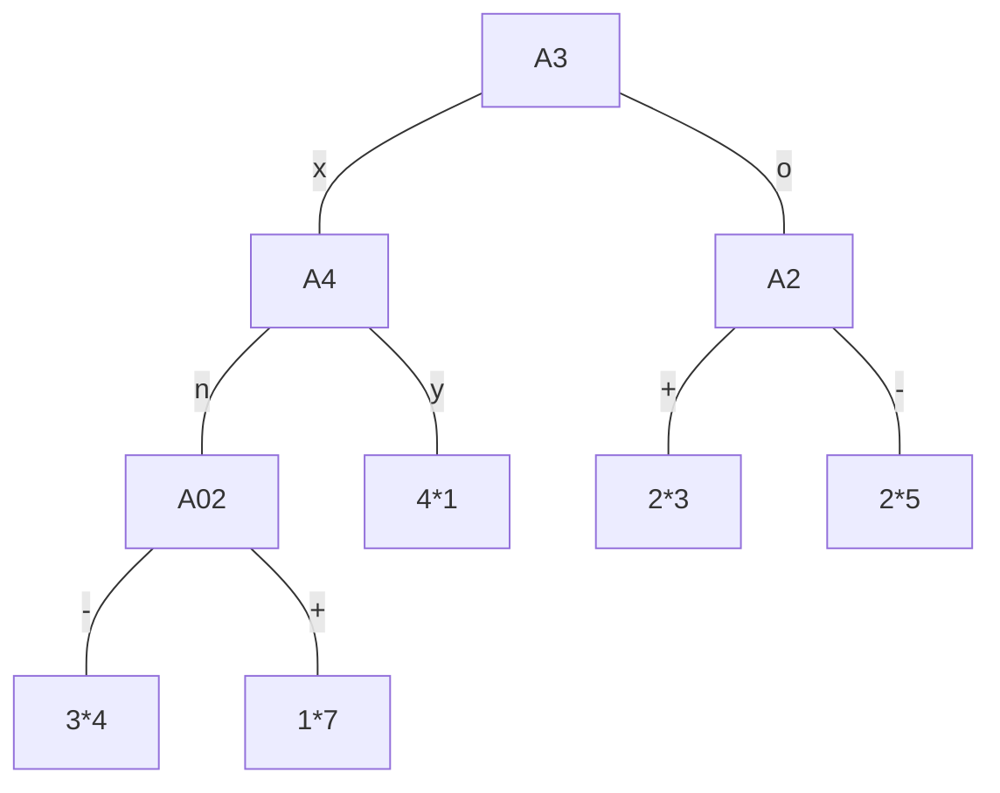

| ID  | A1      | A2  | A3  | A4  | R   |
| --- | ------- | --- | --- | --- | --- |
| 100 | 2000,00 | -   | o   | y   | Da  |
| 101 | 2006        |     |     |     |     |

# 1 naloga
odločitvena drevesa

200:
>$p(DA)=\frac{2}{7}=0.29$
>$p(NE)=\frac{5}{7}=0.71$

202:
>$p(DA)=\frac{\frac{\frac{\frac{8}{15}1}{8}+7}{15}3}{7}=\frac{4}{15}$

201:
>$p(DA)=(\frac{5}{20})*\frac{6}{5}+ \frac{15}{20}* \frac{1}{8}= \frac{47}{160}=0.29$
>$p(NE)= \frac{5}{20} \frac{1}{5}+ \frac{15}{20} \frac{7}{8}=0.71$

# 2 naloga
odločitvena pravila
```
if(A2==+) and (A3== o) and (A4 == y) then: NE
```
najdimo drugo pravilo:
(prism dela po vrsti, drugo pravilo bo pol po tem kar ni blo z tem dobljen)
v tem primeru odčrtamo 110 stran ker ga pokriva

računamo p/t (pokriti proti nepokritim) 

| A2     | +   | 2/5  |                 |
| ------ | --- | ---- | --------------- |
| A2     | -   | 3/5  |                 |
| A3     | o   | 2/5  |                 |
| A3     | x   | 3/5  |                 |
| A4     | y   | 1/3  |                 |
| A4     | n   | 3/7  | TA JE NAJBOLJŠI |
| skupaj | --- | 4/10 |                 |

```
if(A4 == n) and 
```

 | A2     | +   | 2/5 |
 | ------ | --- | --- |
 | A2     | -   | 1/2 |
 | A3     | o   | 1/3 |
 | A3     | x   | 2/4 |
 | skupaj | --- | 3/7 |

"-" in "x" imata enak ulomek, a "x" pokrije več primeroz zato vzamemo tega

```
if(A4 == n) and (A3 == x) AND
```

| A2     | +   | 1/3 |
| ------ | --- | --- |
| A2     | -   | 1/1 | 
| skupaj | --- | 2/4 |

```
if(A4 == n) and (A3 == x) AND (A2 == -) then: NE
```

---

lahko se zgodi da sta dve izbiri enaki dobri, takrat je vseeno katerga damo
# 3 naloga
## clustering
razvrščanje v skupine

# 4 naloga
# 5 naloga
