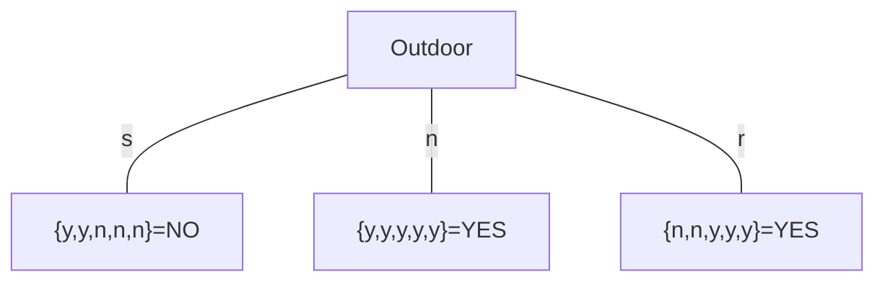

## Učenje enostavnih pravil
### 0R ni pravi klasifikator
|       | $A_1$ | $A_2$ | ... | $A_n$ | C   |
| ----- | ----- | ----- | --- | ----- | --- |
| $v_1$ |       |       | ... |       | X   |
| $v_2$ |       |       | ... |       | Y   |
| $v_3$ |       |       | ... |       | X   |
| ...   | ...   | ...   | ... | ...   | ... |
| $v_m$ |       |       | ... |       | X   |

ne upošteva podatkov v stolpcih($A_n$) ali vrstic ($v_n$) ampak po razredih (C)

### 1R enostavni klasifikator

#### zgodovina algoritma
### Bayes-ovo (statistično) modeliranje

