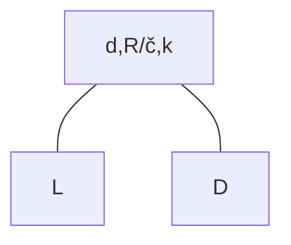

# rang in izbira

dva podrevesa -> levi in desni $O(\log n)$
k -> L< k < D, iskanje samo v podrevesu
R/č -> omogoči znižanje  višine vedno na $O(\log n)$
d -> omogoča implementacijo - Rang, SELECT
## Lastnosti
