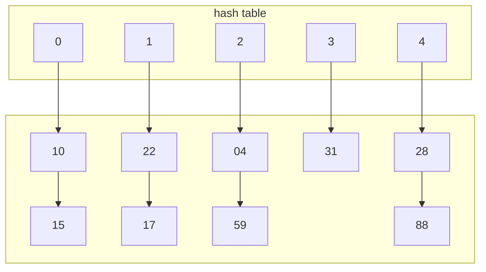

imamo univerzalno množico $U$. v njej imamo $n$ elementov.
Kako lahko tabelo(polje) podamo kot slovar?
 
 ```mermaid
 graph TD
 subgraph a
 A
 B
 C
 D
 E
 end
 ```
 naredimo funkcijo ki jih preslika:
 $h:U\to \{0,...,n-1\}$
 $h(x)=S$
 problem nastane pri **sovpadanju**, kjer se več elemenov lahko preslika v enak $S$. Ta preslikava zato ne more biti **injektivna**(ker je množica v katero slikamo manjša od množice $U$).
 To rešujemo z **Veriženjem** in **naslavljanjem**.
 
 
 # naloga 1
 vstavi ključe v razpršilno tabelo dolžine $m=5$ z uporabo verišenja, pri čemer je razpršilna funkcija $h(k)=(13k)\ mod\ m$. 
  
 | 10  | 22  | 31  | 4   | 15  | 28  | 17  | 88  | 59  | 
 | --- | --- | --- | --- | --- | --- | --- | --- | --- |

>$$h(10)=\ 130\ mod\ 5$$
>$$h(10)=0$$

| 0   | 1   | 2   | 3   | 4   |
| --- | --- | --- | --- | --- |
| 10  |     |     |     |     |

>$$h(22)=13*22\ mod 5$$
>$$h(22)=1$$
>$h(31)=3$
>$h(4)=2$
>$h(15)=0$
> . . . 



Poišči absolutno in povprečno število dostopov do P.S. 
> absolutno je 13 dostopov
> povprečno pa je $\frac{13}{9}=1,4$

Poišči min in MAX števolo dostopov pri vstavljanju nekega ključa.
> minimalno je 1 dostop maksimalno pa je 2.
