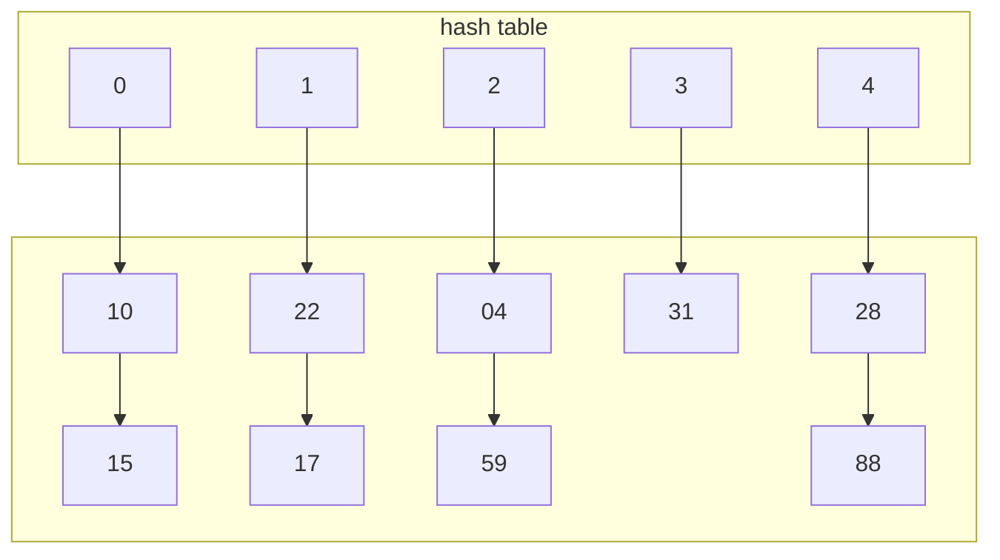
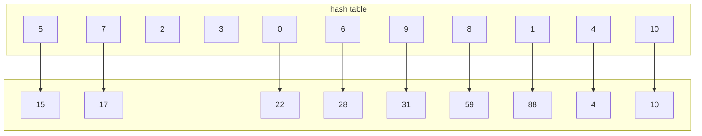
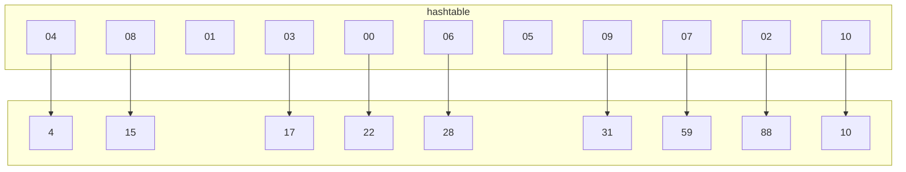

imamo univerzalno množico $U$. v njej imamo $n$ elementov.
Kako lahko tabelo(polje) podamo kot slovar?
 
 ```mermaid
 graph TD
 subgraph a
 A
 B
 C
 D
 E
 end
 ```
 naredimo funkcijo ki jih preslika:
 $h:U\to \{0,...,n-1\}$
 $h(x)=S$
 problem nastane pri **sovpadanju**, kjer se več elemenov lahko preslika v enak $S$. Ta preslikava zato ne more biti **injektivna**(ker je množica v katero slikamo manjša od množice $U$).
 To rešujemo z **Veriženjem** in **naslavljanjem**.
 
 
 
 # naloga 1
 vstavi ključe v razpršilno tabelo dolžine $m=5$ z uporabo verišenja, pri čemer je razpršilna funkcija $h(k)=(13k)\ mod\ m$. 
  
 | 10  | 22  | 31  | 4   | 15  | 28  | 17  | 88  | 59  | 
 | --- | --- | --- | --- | --- | --- | --- | --- | --- |

>$$h(10)=\ 130\ mod\ 5$$
>$$h(10)=0$$

| 0   | 1   | 2   | 3   | 4   |
| --- | --- | --- | --- | --- |
| 10  |     |     |     |     |

>$$h(22)=13*22\ mod 5$$
>$$h(22)=1$$
>$h(31)=3$
>$h(4)=2$
>$h(15)=0$
> . . . 



Poišči absolutno in povprečno število dostopov do P.S. 
> absolutno je 13 dostopov
> povprečno pa je $\frac{13}{9}=1,4$

Poišči min in MAX števolo dostopov pri vstavljanju nekega ključa.
> minimalno je 1 dostop maksimalno pa je 2.

# naloga 2
vstavi ključ v razpršilno tabelo dolžine $m=11$. z uporabo odprtega naslavljanja z funkcijo $h'(k)=k$

 | 10  | 22  | 31  | 4   | 15  | 28  | 17  | 88  | 59  | 
 | --- | --- | --- | --- | --- | --- | --- | --- | --- |

$(i=0,...,m-1)$
1. linearno naslavljanje: $h(k,i)=(h'(k)+1)\mod\ m$
>$h(10,0)=11$
>$h(22,0)=0$
>...
>$h(15,0)=4$
>4 je že polno dodam i
>$h(15,1)=5$ je prazen vpišem.


| absolutno število dostopov | povprečno | min | MAX |
| -------------------------- | --------- | --- | --- |
| 16                         | 1,7       | 1   | 5   | 

pri brisanju: npr briši(15)
>izračunaš, dobiš 4 greš tje ga ni. grem naslednji. je 15 brišem. potrebujemo še povedati da sem na tem polju brisal
>ob vstavljanu potem vemo da je bilo zafilano in zato prej poiščem še naprej če je element že vsebovan. v ta namen je dobro dodati neko polje recimo isDeleted ki vsebuje 0 ali 1 / true ali false i.t.d. da vemo ali smo na tem polju kdaj imeli elemente -> se nek drug element ni mogel vstaviti.

ko iščemo:
> iščemo samo do prvega praznega polja, kjer nato vemo da elementa ni.

3. kvadratično naslavljanje: $h(k,i)=(h'(k)+i+3i^2)\ mod\ m$

>h(10,0)=10
>h(22,0)=0
>...
>h(15,0)-> zafilan
>gremo iskat za i=1
>h(15,1)=8


| absolutno število dostopov | povprečno | min | MAX |
| -------------------------- | --------- | --- | --- |
| 19                         | 1,9       | 1   | 5   | 
5. Dvojno naslavljanje:  $h(k,i)=(h'(k)+i+h''(k))\ mod\ m$
	$h''(k)=1+(k\ mod\ (m-1)$

# Naloga 3
dobra zgoščevalna funkcija 
$$\forall k \in U$$