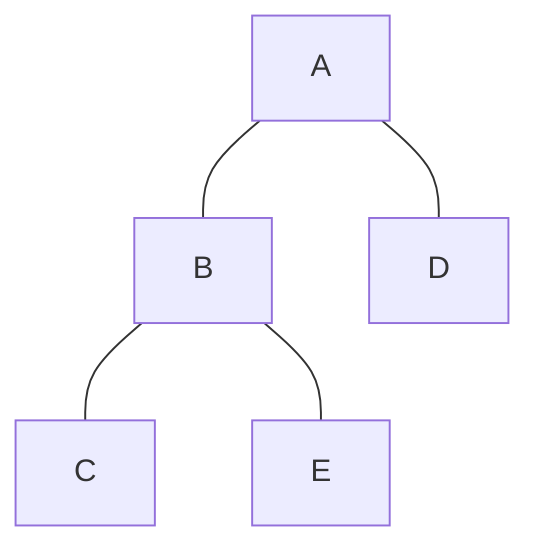
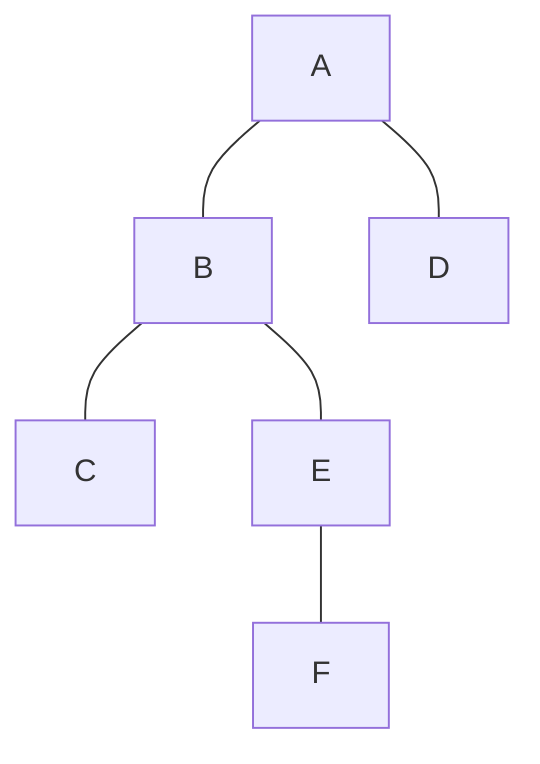

## NALOGA
imamo ključe med  neki {0,1}
$x_1$=1111110
$x_2$=0001010110
$x_3$=0110000
$x_4$=011110

```mermaid
graph TB;
A---B
B---C
A---D
B---E

```

```mermaid
graph TB;
A---B
B---C
A---D
B---E
E---F

```