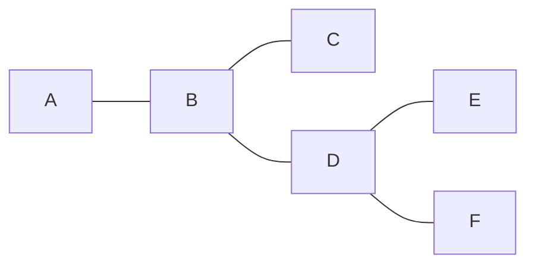
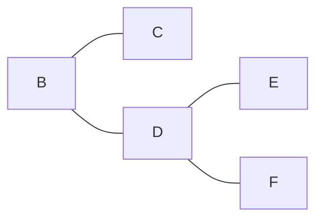
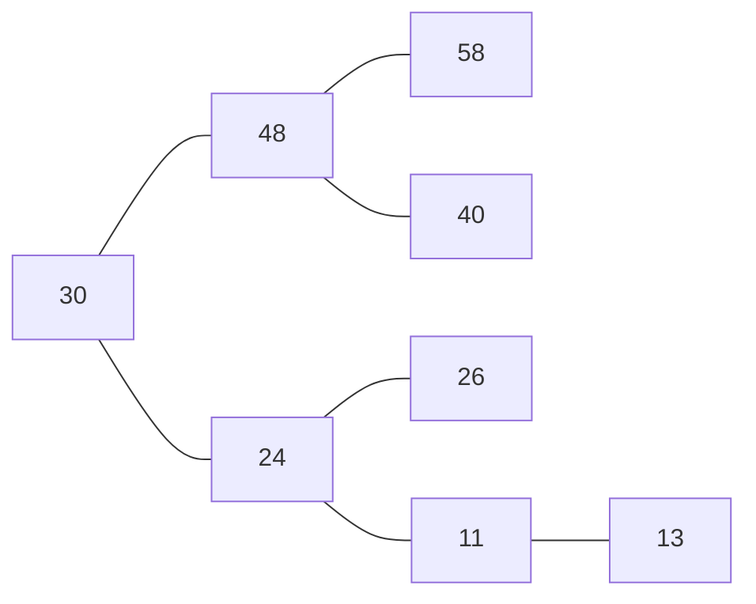
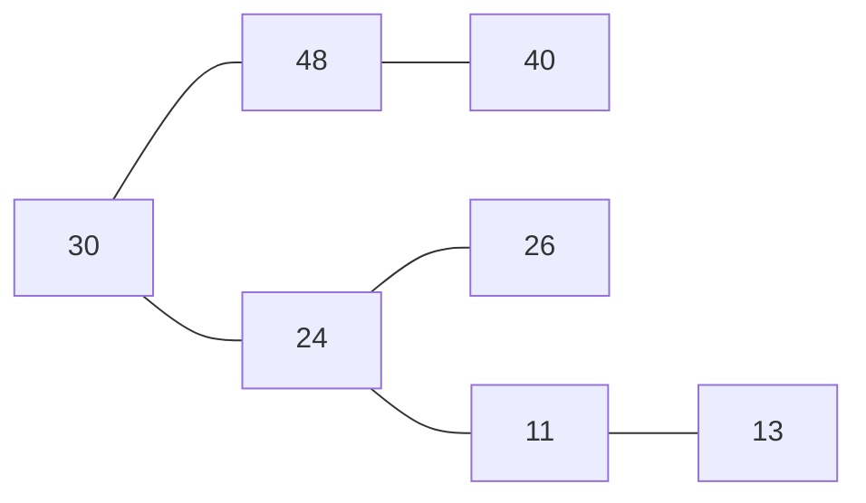

## NALOGA
imamo ključe med  neki {0,1}
$x_1$=1111110
$x_2$=0001010110
$x_3$=0110000
$x_4$=011110

Stisnit po plasteh ->

vsak nivo je en $2^n$ moznih odgovorov aka:
prvi nivo sta mozna 0 ali 1
drugi nivo so mozni 00 01 10 ali 11

## ključi
za n ključev 
imamo nekaj n ključev za $\epsilon$={0,1} 
a) neki neki da ne bo o+nobenega polja/vektorja z drugimi besedami bi za vsako stiskanje po poteh bila gostota vedno prenizka.
kakšne vrdnosti morjo met ključi da ne bo nobenega stiskanja?
> ali vsi začnejo z 0 ali pa z 1

recimo da se vsi ključi začnejo z 0

v primeru z 

se pravi če zelimo da ne bo stiskanja se morajo vsi začeti z 0 ali z 1.
## Dvojiška iskalna drevesa
podoben slovarju? 
je neka struktura ki operira z elementi
Ima:
- iskanje
- brisanje
- vstavljanje
imamo elemente ki jih vstavljamo:
**Ključ** in **podatek**

### Vstavljanje
PRIMER:
mamo : 30,48,58,40,24,26,11,13

### Brisanje

Zbrišemo 58

---
uporabljamo primerjalni primer.

### Pregled
