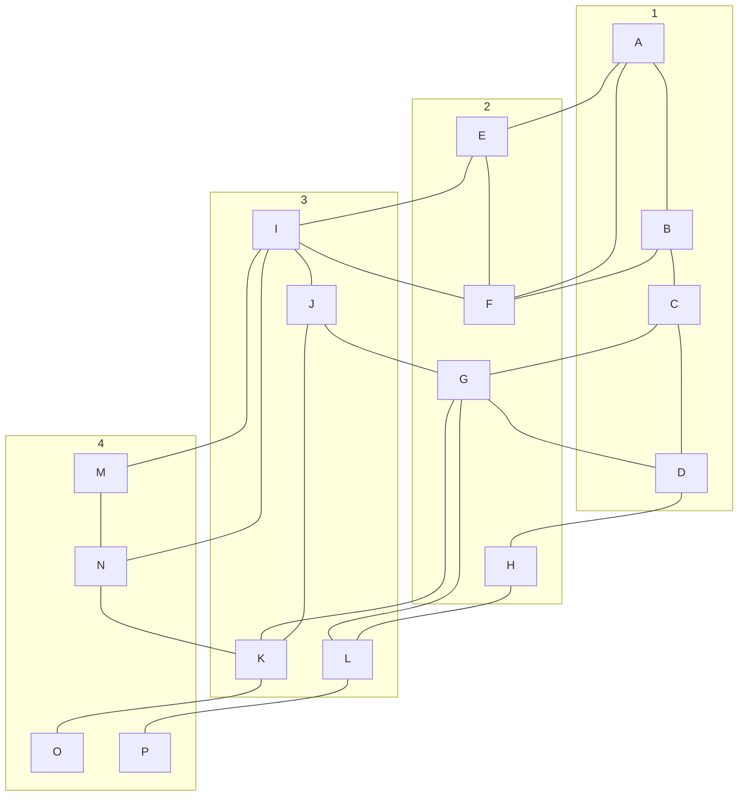
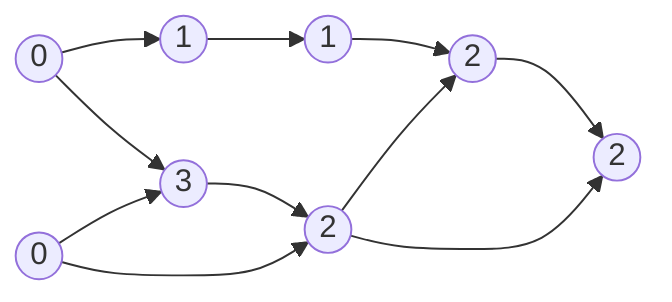
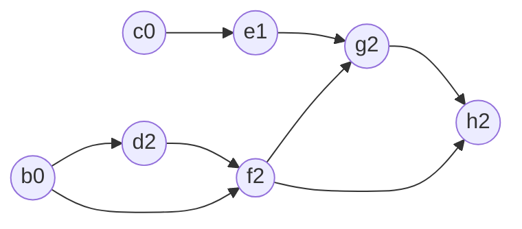
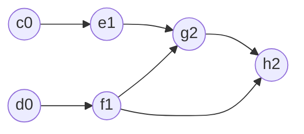
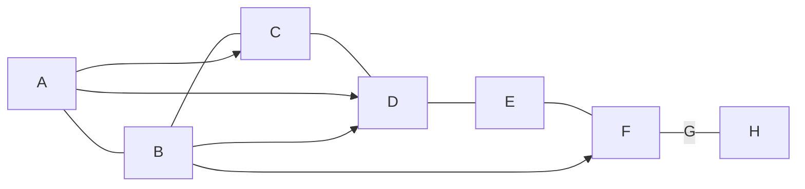

# Grafi
DEF: množica fozlišč in povrzav med njimi.
povrzave so:
- usemerjene -> večkratne povezave = multigraf
	- gledamo v smernih ciklih
	- natanko tisti usmerjeni grafi brez ciklov imajo topološko ureditev -> DAG(direct acyclic graph)
- neusmerjene -> enostavni grafi

## pregled grafa
v **globino** ali v **Širino** 

# Naloge
## 1
Dan je naslednji graf:

### i)
Ilustriraj delovanje algoritma za pregled grafa v globino (DFS) z začetkom v A.

> A---B---C---D---G---J---I---E---F
> ma use obiskane grem nazaj->
> A---B---C---D---G---J---I---E
> ima vse obiskane grem nazaj -> i.t.d
> A---B---C---D---G---J---I---$E$---$F$
> \ \ \ \ \ \ \ \ \ \ \ \ \ \ \ \ \ \ \  M---N---K---O
> \ \ \ \ \ \ \ \ \ \ \ \ \ \ \ \  L---H
> \ \ \ \ \ \ \ \ \ \ \ \ \ \ \ \ \ \ \  P
> > časovna zahtevnost tega algoritma je $O(|V|+|E|)$; $V$->število vozlišč, $E$-> edges- povezave
> > $$|E|\le \frac{|V|(|V|-1)}{2}$$
> > $|E|=O(|V|)$-> potem je redek
> > $|E|=O(|V|^2)$-> potem je gost
> >  
### ii)
-//- v širino (BFS) -//-
Predpostavka: sosede obiščemo v leksikografskem vrstnem redu.

> podatkovna struktura: **navadna vrsta**
> 
> A---B---E---F
> vn damo A, ppogledamo B, dodamo C
> **A**---B---E---F---C
> **A**---**B**---E---F---C---I
> pregledamo E
> **A**---**B**---**E**---F---C---I---D
> pregledamo F
> **A**---**B**---**E**---**F**---**C**---I---D---G
> itd.. pregledamo node, dopišemo tiste ki so na njem, zbrišemo tega, gremo na naslednjega.
> **A**---**B**---**E**---**F**---**C**---**I**---**D**---**G**---**J**---**M**---**N**---**H**---**K**---**L**---**O**---**P**
> 
> iskanje v širino, dobimo elemente ki so oddaljeni v številu vozlišč od A

| 0   | 1   | 2   | 3   | 4   | 5   |
| --- | --- | --- | --- | --- | --- |
| A   | B   | C   | M   | K   | P   |
|     | F   | I   | N   | H   | O   |
|     | E   |     | J   | G   |     |
|     |     |     | D   | L   |     |

## 2 usemrjen ack+iklicni grapf
poišči topološko ureditev naslednjega urejenega acikličnega grafa:

notranje vrednosti so število vhodnih povezav

zbrišem A

zbrišemo B

(mogla bi bit linija od A do H) pa topološko povezan pol gor
