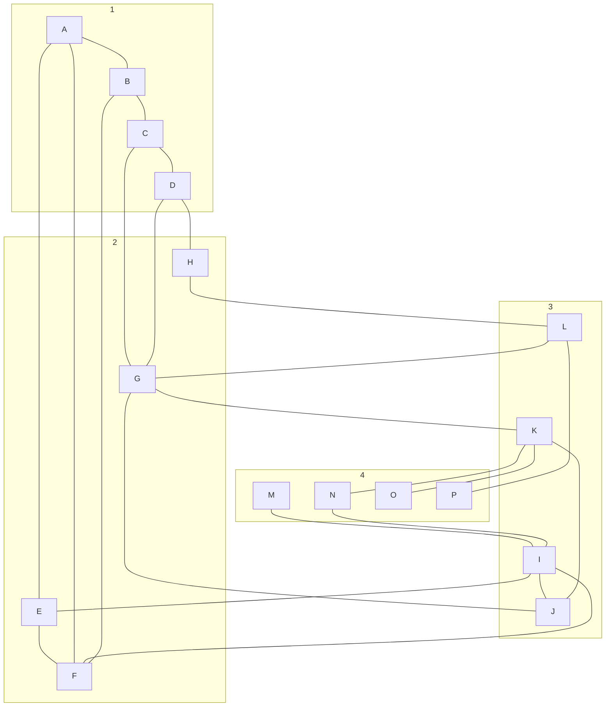

# Grafi
DEF: množica fozlišč in povrzav med njimi.
povrzave so:
- usemerjene -> večkratne povezave = multigraf
- neusmerjene -> enostavni grafi

## pregled grafa
v **globino** ali v **Širino** 

# Naloge
## 1
Dan je naslednji graf:

### i)
Ilustriraj delovanje algoritma za pregled grafa v globino (DFS) z začetkom v A.
### ii)
-//- v širino (BFS) -//-
Predpostavka: sosede obiščemo v lek
