# Grafi
DEF: množica fozlišč in povrzav med njimi.
povrzave so:
- usemerjene -> večkratne povezave = multigraf
	- gledamo v smernih ciklih
	- natanko tisti usmerjeni grafi brez ciklov imajo topološko ureditev -> DAG(direct acyclic graph)
- neusmerjene -> enostavni grafi

## pregled grafa
v **globino** ali v **Širino** 
### Širino
dobimo vpeto drevo ki sovpada z drevesom ki bi ga dobili pri daikstrobem algoritmu.

# Naloge
## 1
Dan je naslednji graf:

```mermaid
graph TD
subgraph 1

A
B
C
D
end
subgraph 2
E
F
G
H
end
subgraph 3
I
J
K
L
end
subgraph 4
M
N
O
P
end
A---B---C---D
E---F
I---J---K
M---N

A---E---I---M
B---F
C---G---K---O
D---H---L---P

I---F
J---G---D
N---K

G---L
A---F
I---N

```

### i)
Ilustriraj delovanje algoritma za pregled grafa v globino (DFS) z začetkom v A.

> A---B---C---D---G---J---I---E---F
> ma use obiskane grem nazaj->
> A---B---C---D---G---J---I---E
> ima vse obiskane grem nazaj -> i.t.d
> A---B---C---D---G---J---I---$E$---$F$
> \ \ \ \ \ \ \ \ \ \ \ \ \ \ \ \ \ \ \  M---N---K---O
> \ \ \ \ \ \ \ \ \ \ \ \ \ \ \ \  L---H
> \ \ \ \ \ \ \ \ \ \ \ \ \ \ \ \ \ \ \  P
> > časovna zahtevnost tega algoritma je $O(|V|+|E|)$; $V$->število vozlišč, $E$-> edges- povezave
> > $$|E|\le \frac{|V|(|V|-1)}{2}$$
> > $|E|=O(|V|)$-> potem je redek
> > $|E|=O(|V|^2)$-> potem je gost
> >  
### ii)
-//- v širino (BFS) -//-
Predpostavka: sosede obiščemo v leksikografskem vrstnem redu.

> podatkovna struktura: **navadna vrsta**
> 
> A---B---E---F
> vn damo A, ppogledamo B, dodamo C
> **A**---B---E---F---C
> **A**---**B**---E---F---C---I
> pregledamo E
> **A**---**B**---**E**---F---C---I---D
> pregledamo F
> **A**---**B**---**E**---**F**---**C**---I---D---G
> itd.. pregledamo node, dopišemo tiste ki so na njem, zbrišemo tega, gremo na naslednjega.
> **A**---**B**---**E**---**F**---**C**---**I**---**D**---**G**---**J**---**M**---**N**---**H**---**K**---**L**---**O**---**P**
> 
> iskanje v širino, dobimo elemente ki so oddaljeni v številu vozlišč od A

| 0   | 1   | 2   | 3   | 4   | 5   |
| --- | --- | --- | --- | --- | --- |
| A   | B   | C   | M   | K   | P   |
|     | F   | I   | N   | H   | O   |
|     | E   |     | J   | G   |     |
|     |     |     | D   | L   |     |

## 2 usemrjen ack+iklicni grapf
poišči topološko ureditev naslednjega urejenega acikličnega grafa:

(DAG)
notranje vrednosti so število vhodnih povezav

zbrišem A

zbrišemo B

(mogla bi bit linija od A do H) pa topološko povezan pol gor

## 3
povezan neusmerjen graf
iščemo vpeto drevo:
Dan je graf z utežmi na povezavah:

### i)
Ilustrijar delovanje Poimovega algoritma na zgornji grag z začetkom v A
> razdalja v A je 0
> ostale razdalje so $\infty$

neki delamo pride:

	
### ii)
-//- Kraskovega algoritma na zgornji graf. DAIKSTROV ALGORITEM 
uredimo povezave po močeh od najmanše do največje. 
najcenejša povezava je DE

na začetki je gozd vozlišč.
dodamo najcenješe povezave.
DE,EC,AB,DF in dodamo AC ali BE.
TL;DR: nardiš vozlišča pa greš povezvat od najmanše vrtednosti do največje brez da cikle nardiš.

Začnemo v A, d postane enak 0. pogledam prvega soseda če je nova razdalja boljša jo posodobim, in si shtanim starša od njega.

podobno ponovim za C in D

2korak. ponovimo postopek z tem ki ima najmanjšo razdaljo. D gre v rešitev:
A---D---

| A   | B   | C   | D   | E   | F   | G   | H   |
| --- | --- | --- | --- | --- | --- | --- | --- |
| A   | A   | A   | A   | E   | F   | G   | H   |

A--D--C stane 5 kar je bolje kot 6 zato popravim iz cja na D, podobno Za F in G.

| A   | B   | C   | D   | E   | F   | G   | H   |
| --- | --- | --- | --- | --- | --- | --- | --- |
| A   | A   | D   | A   | E   | D   | D   | H   |

 zdaj lahko do C dostopamo preko A---D---F---C, kar spremeni iz c(5) na c(4).
 Končni pride:

| A   | B   | C   | D   | E   | F   | G   | H   |
| --- | --- | --- | --- | --- | --- | --- | --- |
| A   | A   | F   | A   | C   | D   | F   | E   |

$O(|E|log|V|)$, V vozliča, E sosedi

# 4
V butalah so vse ceste dolge eno miljo. peter zmeda ponuja aplikacijo ki izračuna najkrajšo pot med dvema krajema. 

## i) 
opiši podatkovno strukturo ki naj jo peter zmeda uporabi v svoji aplikaciji. potem pa zapiši algoritem ki izračuna razdalje med krajema A in B. analiziraj časovno zahtevnost.

uporabimo: NEUSMERJEN GRAF, ni treba uteženga ker so vse 1milja.

Razdalja med A in B:
> Daikstrov algoritem -> začnemo v korenu (A ali B)-> $O(|E|log|V|)$
> lahko tudi beimanfordov ($O$ je podoben)
> ali pa [[#Širino]] -> s tem je $O(|V|+|E|)$
> 

## i-i)
pezer zmeda hoče enkrat in za zmeraj poračunati najlrajše poti vseh parov vozlišč.
> To je Daikstrov algoritem(Uteženo iskanje v širino)

ali lahko peter zmeda najde boljšo rešitev kot je Froyd Warsaw?
> Da, ker je razdalja vedno 1, se lahko uporabi iskanje v širino.
> $O(|V|(|V|+|E|))=O(|V|^2+|E||V|)$

## iii)
Nov župan novi odloki. sedaj so ceste lahko dolge 1 ali 2 milji. Ali lahko peter zmeda še vedno učinkovito uporabi rešitev iz točke [[#i-i]]?
> vsaki poti, ki je dolžine 2 dodamo navidezno točko. s tem se ohranijo razdalje =1 milja.

# 5
Dvodelni graf je graf kjer množico vozlišč $V$ lahko razdelimo na dve podmnožici: $V_1$ in $V_2$, tako da vse povezave $u,v\in E$ velja $u\in V_{1}\wedge v\in V_{2}$.

## 1)
napišite matriko sosednosti za graf na sliki.
| /   | 1   | 2   | 3   | 4   | 5   | 6   | 7   |
| --- | --- | --- | --- | --- | --- | --- | --- |
| 1   | 0   | 1   | 0   | 0   | 0   | 1   | 1   |
| 2   | 1   | 0   | 0   | 0   | 0   | 0   | 0   |
| 3   | 0   | 0   | 0   | 0   | 0   | 0   | 1   |
| 4   | 0   | 0   | 0   | 0   | 1   | 0   | 0   |
| 5   | 0   | 0   | 0   | 1   | 0   | 0   | 0   |
| 6   | 1   | 0   | 0   | 0   | 0   | 0   | 0   |
| 7   | 1   | 0   | 1   | 0   | 0   | 0   | 0   | 

## 2)
Recimo da imamo dvodelni graf $G(V,E)$ , kjer je $|V|=n$ ter $|V_1|=n_1$ in $|V_2|=n_2$. 
Opiši kako izgleda matrika sosednosti grafa $G$ in utemelji odgovor.

posamezen blok $(1,a)X(1,a)$ in $(a,n)X(a,n)$ bosta polna ničel 

## 3)
napiši agoritem, ki preveri ali je graf dvodelen. in analizeraj časovno  zahtevnost
> lahko z barvo recimo $V_1$ so vsa zelena, $V_2$ pa rdeča.
> vsako vozlišče ki dodaš ga pobarvaš z drugo barvo, vsaka k jo dobiš pa preveriš a je prou pri algoritmu.

# 6
Hemiltonov obhod / cikel -> vsa vozlišča moramo biskati natanko enkrat, hkrati pa moramo priti na startno točko. je MP problem.
MP problem -> je nedetrministični algoritem, njegova rešitev lahko preverimo v polinomsem času v velikosti podatka. 

algoritem mora vrnit nek certifikat ki pove če obstaja ali ne  in dokaz za to. to dokzilo mora biti preverlijvo v polinomskem času.

## 2
K-Hamiltonov problem -> vrne obhod v grafu ki je dolžine vsaj $k$ .

# 
