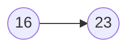
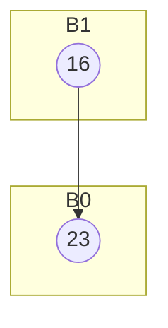
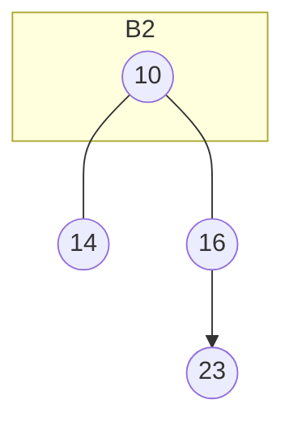
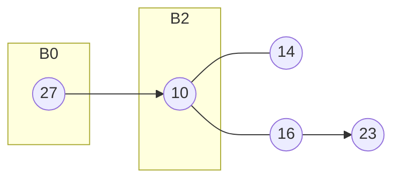
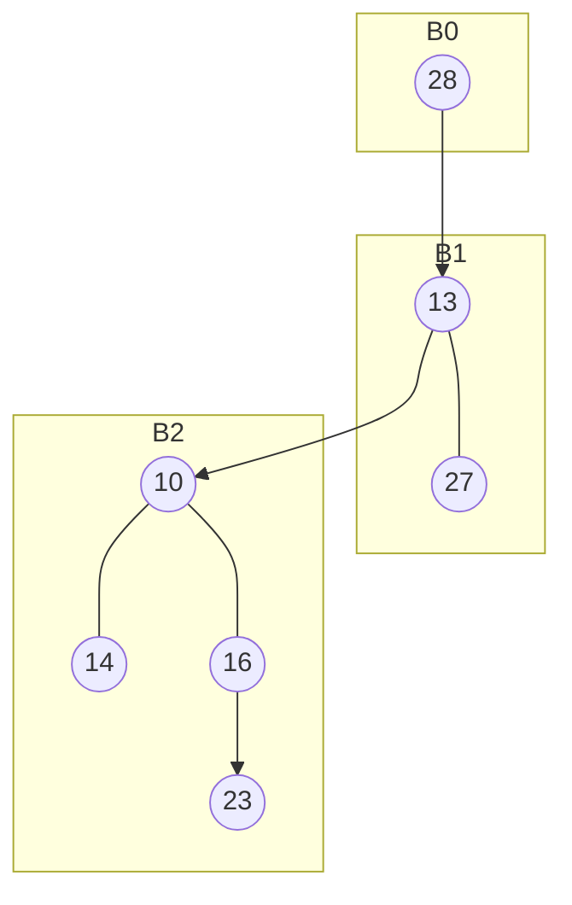
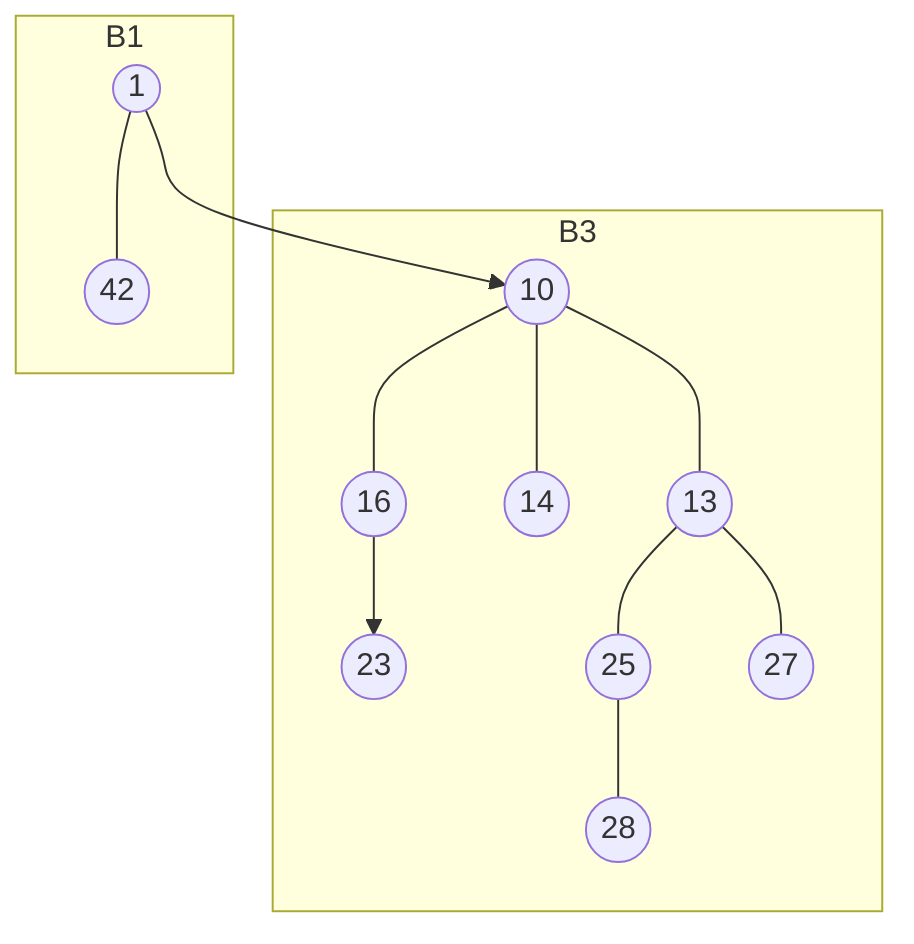
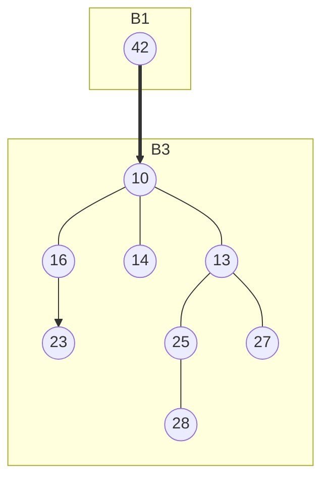
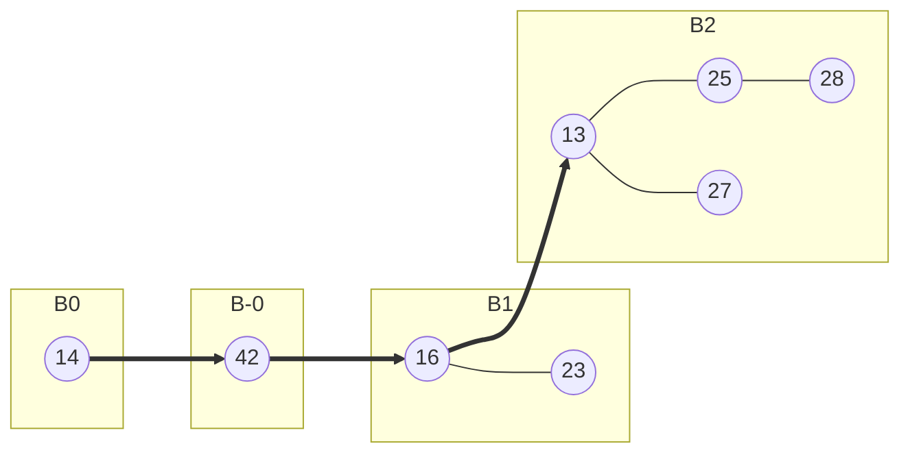
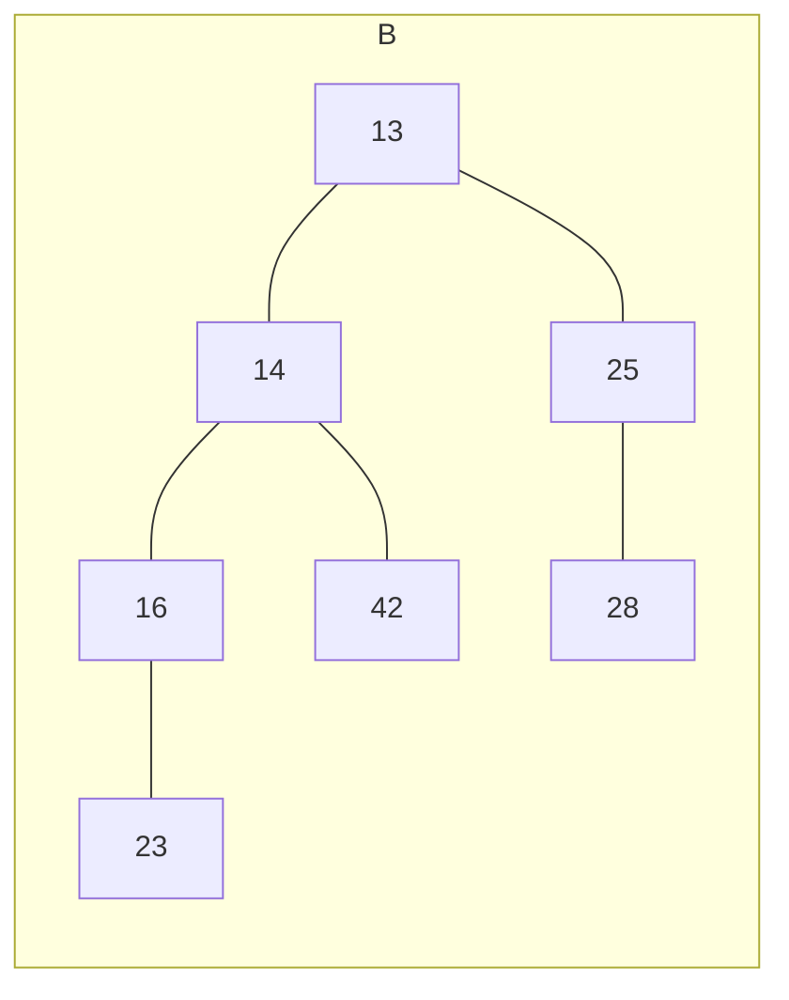

# binomske kopice
kot drevo: 
- če je reda 0
	- ima 1 element
- če je reda 1
	- ima 2 elementa
- če je reda k

$B_k$ predstavlja katerega reda je. 

imamo kopičasto ureditev (koren je najmanjši)

## Binomsko drevo reda k ($B_k$) ima $2^k$ elementov
```mermaid
graph TD
subgraph k=0
A((1))
end
subgraph k=1
A1((1))---B1((5))
end
subgraph k=2
A2((1))---B2((2))---C2((6))
A2---D2((5))
end
```
pokaži da ima $B_k$ na $i$-ti plasti $\binom{k}{i}$ elementov. 

| i   | $\binom{2}{k}$ | n   |
| --- | ------------- | --- |
| 0   | 0             | 1   |
| 1   | 1             | 2   |
| 2   | 2             | 1   |

indukcija na $i$
> bodi $i=0$: na plasti 0 je vedno 1 element -> $\binom{k}{0}=1$
> 
> I.P : na $i$-ti plasti je $\binom{k}{i}$ elementov.
> I.K : $i$ -> $i$+1
> pokažimo, da je na ($i+1$)-plasti $\binom{k}{i+1}$ elementov.
> 
> na $i$-ti plasti v $B_{k+1}$ je vsota elementov na $i$-ti plasti $B_k$ na ($i-1$)-plasti v $B_k$
> 
> Po I.P. je teh elementov: $$\binom{k}{i}+\binom{k}{i-1}=\frac{k!}{i!(k-i)!}+\frac{k!}{(i+1)!(k-i+1)!}=$$
> $$\frac{k!(k+1)}{i!(k+1-i)!}=\binom{k+1}{i}$$

## Vstavi nasledne elemente v binomsko kopico

| 16  | 23  | 14  | 10  | 27  | 13  | 28  | 25  | 42  | 1   | 
| --- | --- | --- | --- | --- | --- | --- | --- | --- | --- |

->16

->16->23


->preublikujemo 

->14->10

->27

->13->28

final(25->1->42)


### Na zadnji binarni kopici naredi dvakrat delete(min() )
po prvem brisanju

brisanje2

~> 
