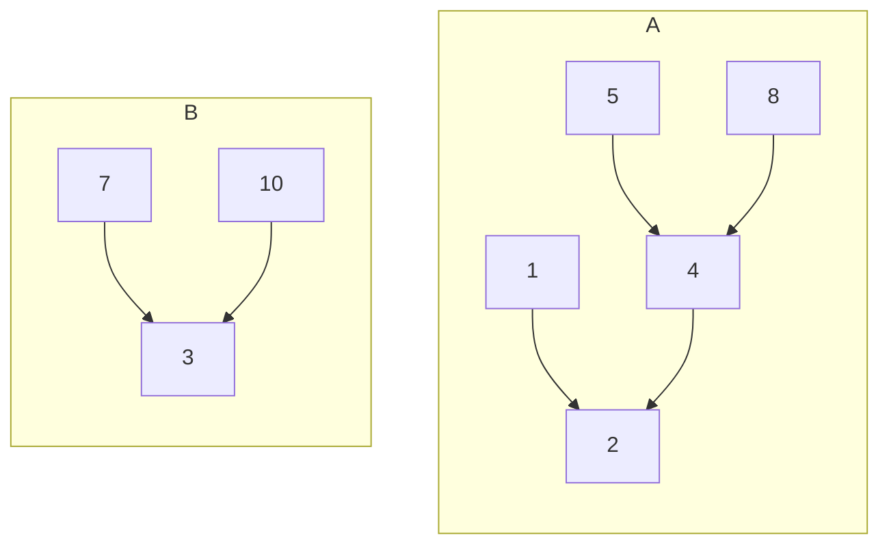

$$A=\{2,8,1,4,5\}$$

$$B=\{3,7,10\}$$

| 1   | 2   | 3   | 4   | 5   | 6   | 7   | 8   | 9   | 10  |
| --- | --- | --- | --- | --- | --- | --- | --- | --- | --- |
| 2   | 2   | 3   | 2   | 4   | 6   | 3   | 4   | 4   | 3   |

find je drag ostali so konstantni.
