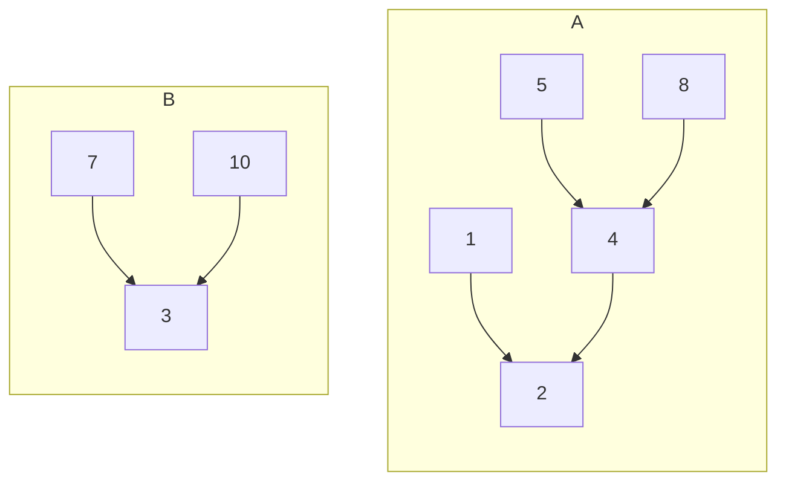
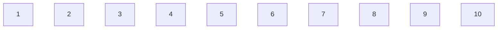
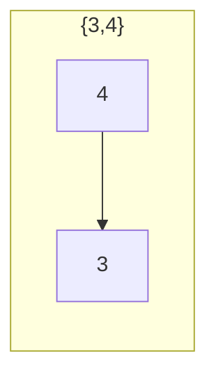
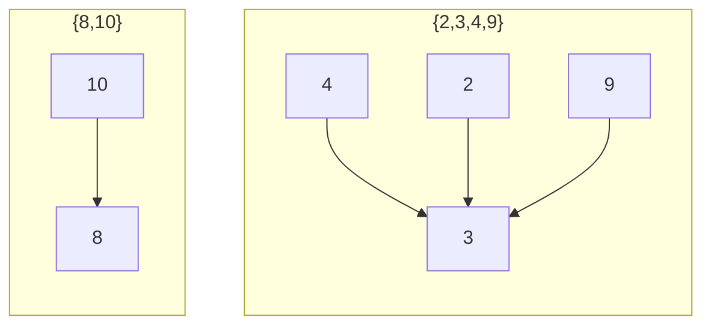

$$A=\{2,8,1,4,5\}$$

$$B=\{3,7,10\}$$

| 1   | 2   | 3   | 4   | 5   | 6   | 7   | 8   | 9   | 10  |
| --- | --- | --- | --- | --- | --- | --- | --- | --- | --- |
| 2   | 2   | 3   | 2   | 4   | 6   | 3   | 4   | 4   | 3   |

find je drag ostali so konstantni.

# nal
v mno disjunktnih množic $\{\{1\},\{2\},...,\{10\}\}$izvedi naslednje zaporedje operacij:

Unija(3,4), Unija(4,9), Unija(5,6), Unija(8,0), Unija(2,3), Unija(5,6), Unija(5,9), Unija(7,3), Unija(4,8), Unija(6,1).
Po vsaki operaciji  nariši pripadajoče drevo.

