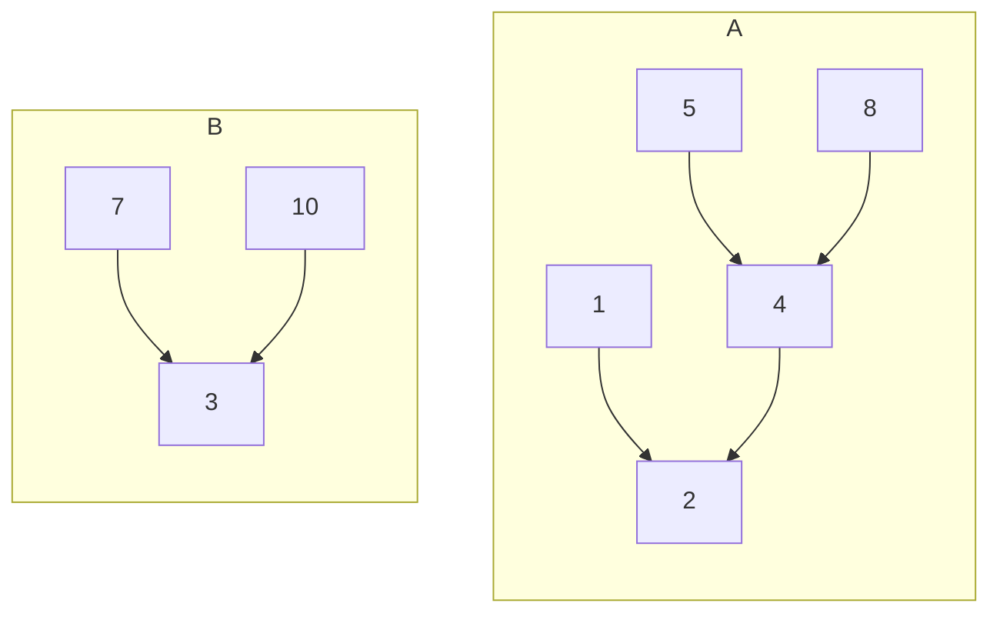
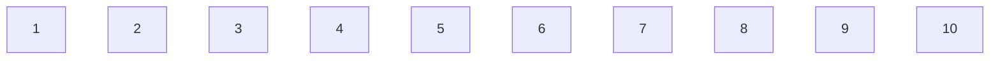
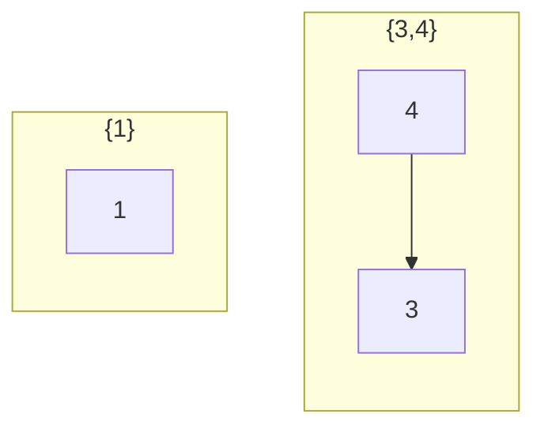
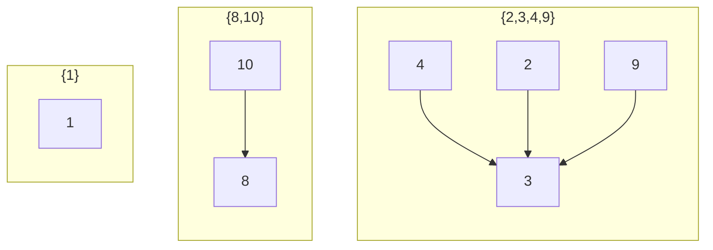
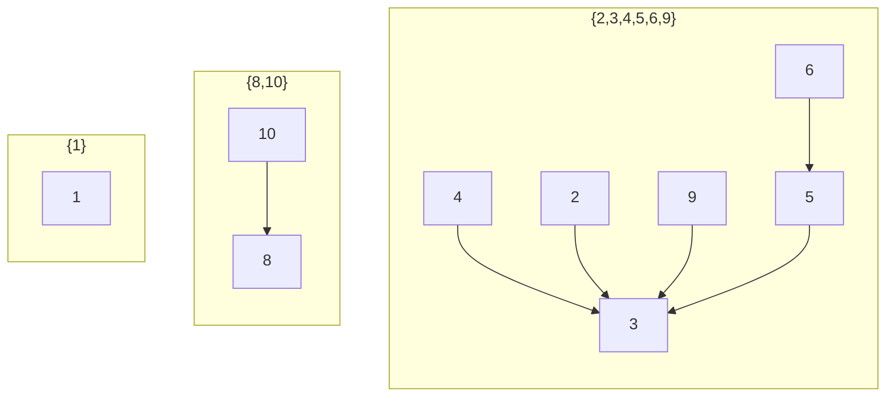
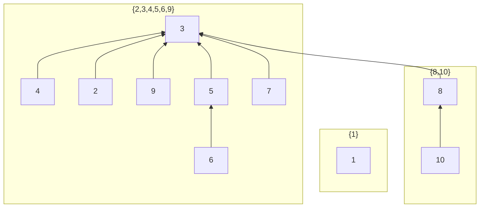
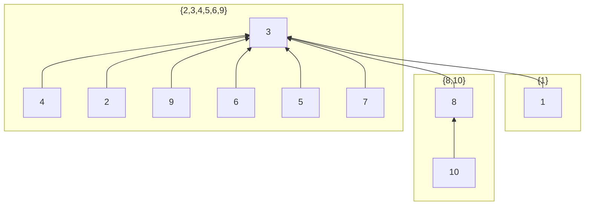

# Množica
$$A=\{2,8,1,4,5\}$$

$$B=\{3,7,10\}$$




| 1   | 2   | 3   | 4   | 5   | 6   | 7   | 8   | 9   | 10  |
| --- | --- | --- | --- | --- | --- | --- | --- | --- | --- |
| 2   | 2   | 3   | 2   | 4   | 6   | 3   | 4   | 4   | 3   |

find je drag ostali so konstantni.


## naloga
v mno disjunktnih množic $\{\{1\},\{2\},...,\{10\}\}$izvedi naslednje zaporedje operacij:

Unija(3,4), Unija(4,9), Unija(5,6), Unija(8,0), Unija(2,3), Unija(5,6), Unija(5,9), Unija(7,3), Unija(4,8), Unija(6,1).
Po vsaki operaciji  nariši pripadajoče drevo.


dodamo 2,9,8,10

dodamo 5,6

pri 



union (6,1)
stiskamo... <- ker se je iskalo 6 (pri uniji) ko potuješ čez referecne jih na koncu na končen koren pripneš direktno, zato da direktno na koren kažejo.


# Hitro urejanje
vse elemente ki so manjši od pivota damo na eno stran- "deli in vladaj". na koncu te probleme združimo.
ena delitev za polje $n$ stane $O(n)$

## naloga
hitro urejanje z zadnjim elementom kot pivotom. Kakšna je časovna zahtevnost tega hitrega urejanja na naraščajočem urejenem seznamu? $n^2$-> n-1 krat mormo delit

# Merge/ Zlivanje
delimo na prvo polovico in drugo. s tem je $O()$ vedno konstanten (1). 

```mermaid
graph TD
subgraph a
2
7
9
3
1
8

end
subgraph aa
A[2 7 9]
B[3 1 8]
end
2---A
7---A
9---A
3---B
1---B
8---B
subgraph aaa
A---AA[2]
A---AA2[7 9]
B---BB[3]
B---BB2[1 8]
end

subgraph aaaa
AA2---AAA[]
BB2---BBB[]
AA2---AAA2[]
BB2---BBB2[]
end

```