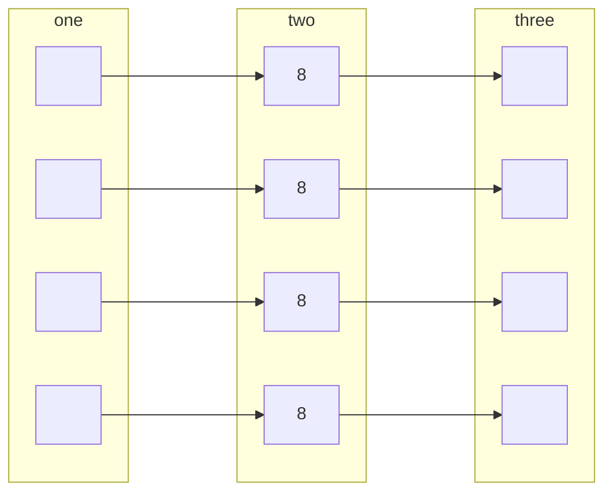
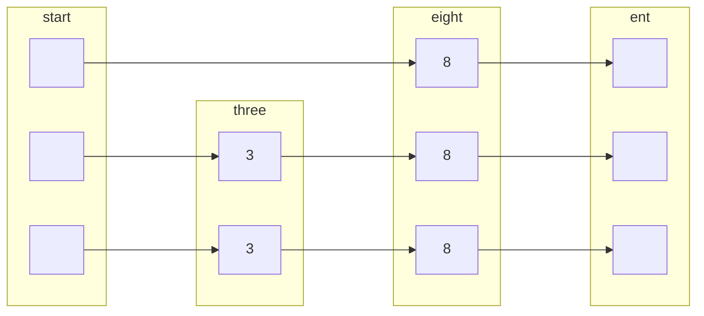
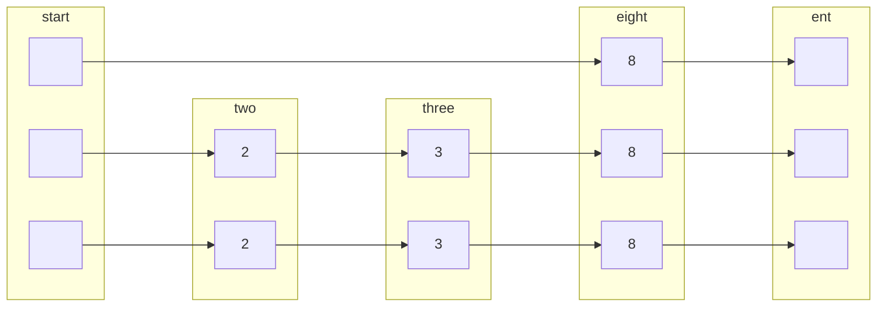
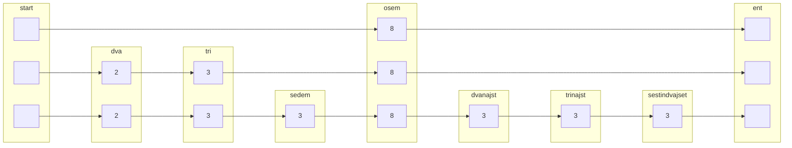

# Povezan seznam
mora biti urejen, zato je vstavljanje drago.

## Primer:
v preskočni seznam vstavi naslednje elemente:
kjer generator naključnih števil vrne naslednje zapredje:

| 8   | 2   | 3   | 7   | 13  | 12  | 26   |
| --- | --- | --- | --- | --- | --- | ---- |
| 110 | 10  | 10  | 0   | 0   | 0   | 1110 |

dodamo 3:

doamo 2:

dodamo vse:
