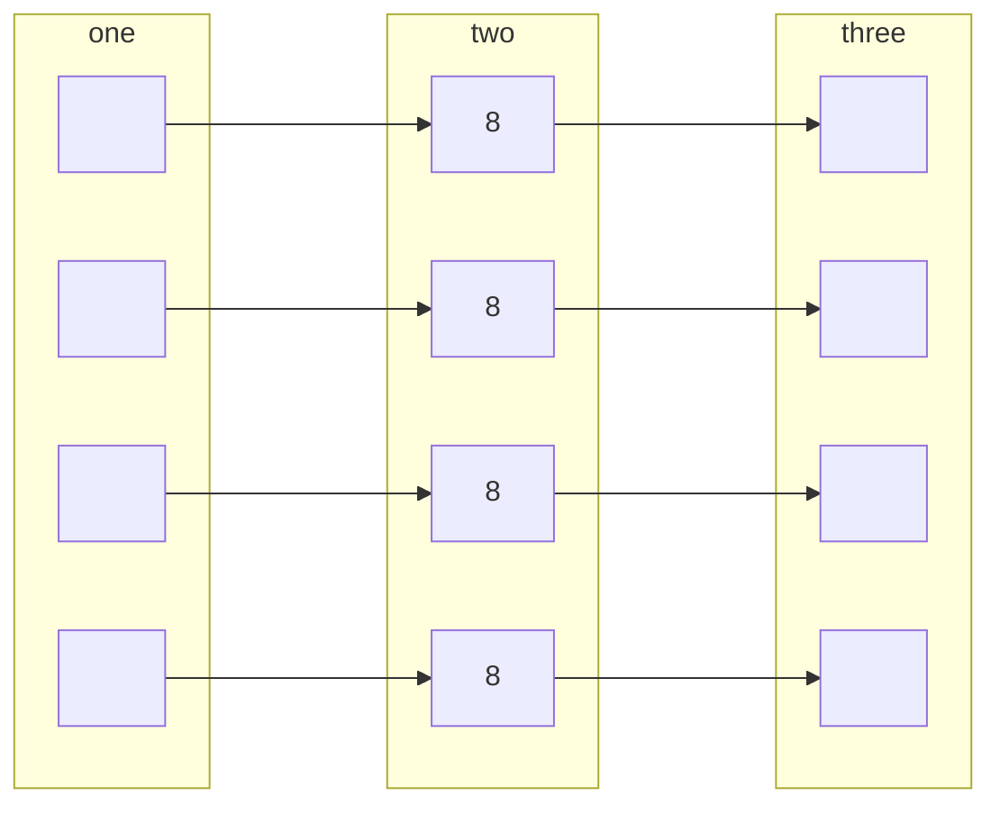
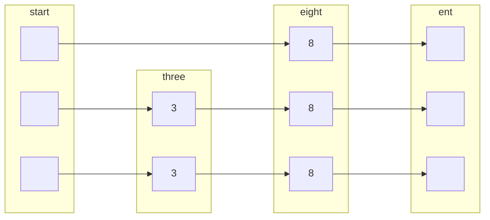
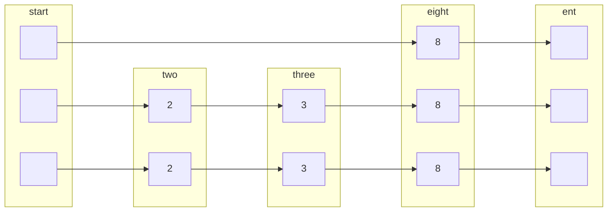
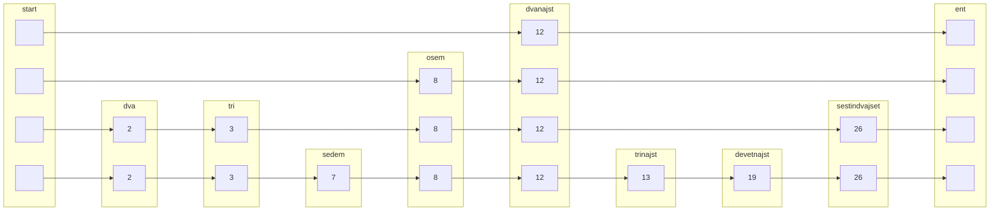
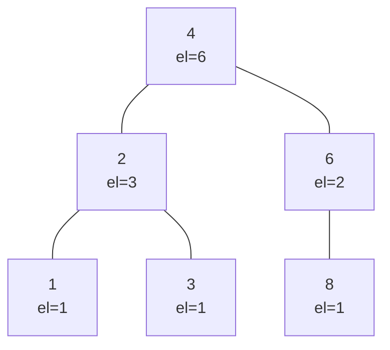

# Povezan seznam
mora biti urejen, zato je vstavljanje drago.

## Primer:
v preskočni seznam vstavi naslednje elemente:
kjer generator naključnih števil vrne naslednje zapredje:

| 8   | 2   | 3   | 7   | 13  | 12  | 26   | 19  | 
| --- | --- | --- | --- | --- | --- | ---- | --- |
| 110 | 10  | 10  | 0   | 0   | 0   | 1110 |     |

dodamo 3:

doamo 2:

dodamo vse:

 Pričakovana višina je  $\log n$
 zaradi random.
 najslabša je vseeno lahko $O(n)$
 
 
 če imamo n števil in bi jih radi uredili?
 
 **V seznam bi radi še dodali izbiro in rang**
 ## Izbira
 
 ## Rang
 vrne kateri po vrsti je x v seznamu
 
# AVL drevo

| 1   | 2   | 3   | 4   | 6   | 8   | 
| --- | --- | --- | --- | --- | --- |

Rang($S$,6)=5
$O(\log n)$

dodamo 7
