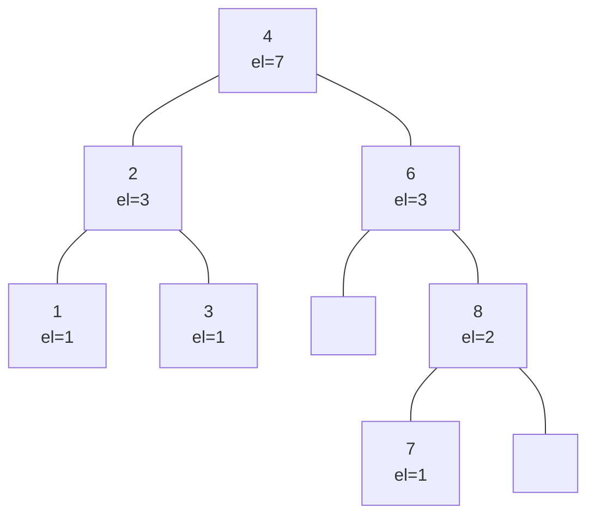
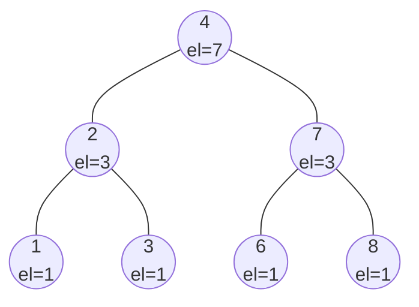

# Povezan seznam
mora biti urejen, zato je vstavljanje drago.

## Primer:
v preskočni seznam vstavi naslednje elemente:
kjer generator naključnih števil vrne naslednje zapredje:

| 8   | 2   | 3   | 7   | 13  | 12  | 26   | 19  | 
| --- | --- | --- | --- | --- | --- | ---- | --- |
| 110 | 10  | 10  | 0   | 0   | 0   | 1110 |     |

dodamo 3:

doamo 2:

dodamo vse:

 Pričakovana višina je  $\log n$
 zaradi random.
 najslabša je vseeno lahko $O(n)$
 
 
 če imamo n števil in bi jih radi uredili?
 
 **V seznam bi radi še dodali izbiro in rang**
 ## Izbira
 
 ## Rang
 vrne kateri po vrsti je x v seznamu
 
# AVL drevo

| 1   | 2   | 3   | 4   | 6   | 8   | 
| --- | --- | --- | --- | --- | --- |

Rang($S$,6)=5
$O(\log n)$

dodamo 7:

treba še rotacijo narest:

| 1   | 2   | 3   | 4   | 6   | 7   | 8   | 
| --- | --- | --- | --- | --- | --- | --- |

# Trejta naloga
Imamo AVl drevo $S$ z $n$ elementi skupaj s podatkom o številu vozlišč v posameznem podrevesu. gre za razširjeno podatkovno strukturo, ki učinkovito implementera Rang. in element $x$. poišči v $O(\log n)$ $i$-tega  naslednjika elementa x.

>$Select(S,Rang(S,x)+i)$

# četrta naloga
imamo polje $A$ z $n$ različnimi elementi.
če je $i<j$ in $A[i]>A[j]$, potem paru $(i,j)$ rečemo **Transpozicija**
Opiši algoritem, ki z uporabo Ranga prešteje število vseh transpozicij v A v času $O(n\log n)$

| X    | 2   | 4   | 6   | 1   | 8   | 7   |
| ---- | --- | --- | --- | --- | --- | --- |
| Rang | 1   | 2   | 3   | 4   | 5   | 6   |

**j=4** primerjamo vse do 4 ranga.
$Trans(j)$ = $|\{i;i<j \land A[i]>A[j]\}|$

| x   | Trans(x) |
| --- | -------- |
| 2   | 0        |
| 4   | 3        |
| 3   | 0        |
| 5   | 0        |
| 6   | 1        |

$$\# transpozicij\ =\ \sum_{j=2}^n Trans(j)$$

$$Trans(j)=\ j-Rang$$