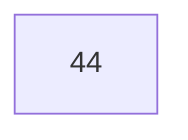
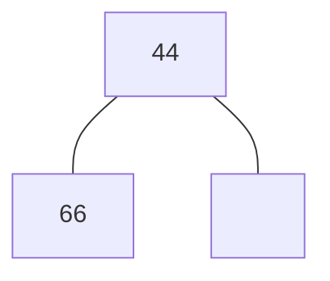
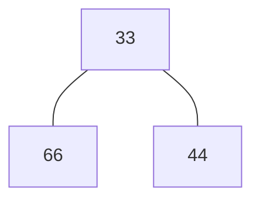
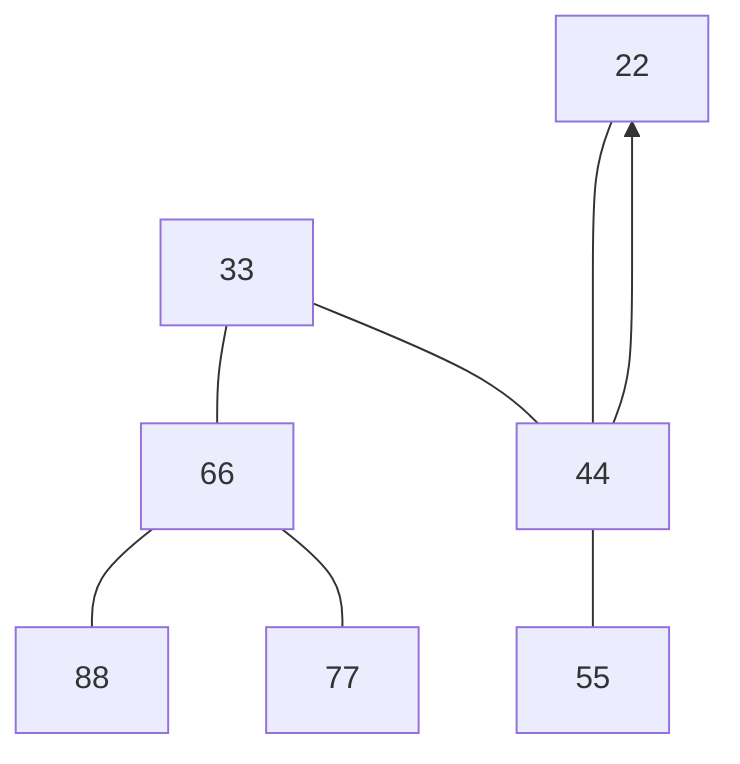
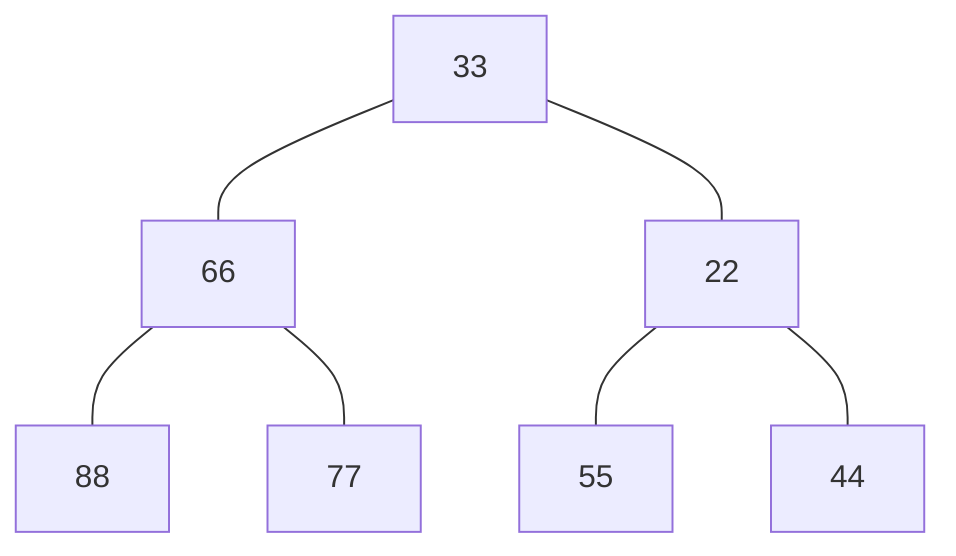
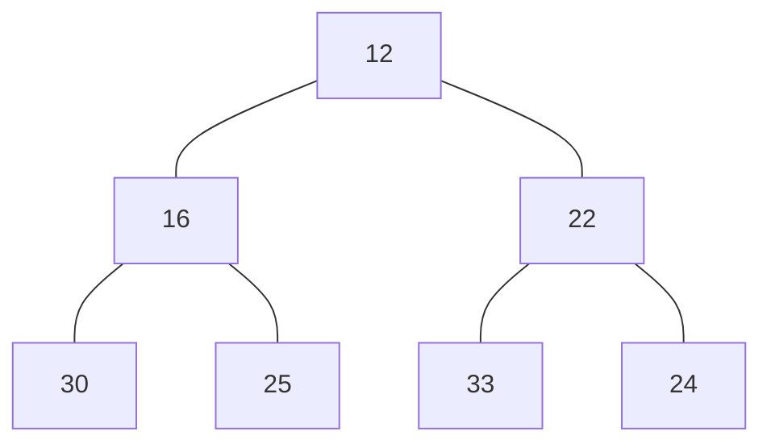
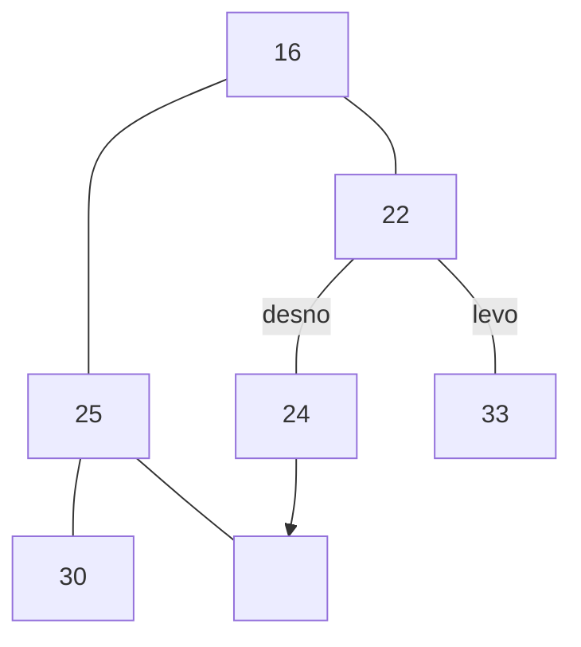
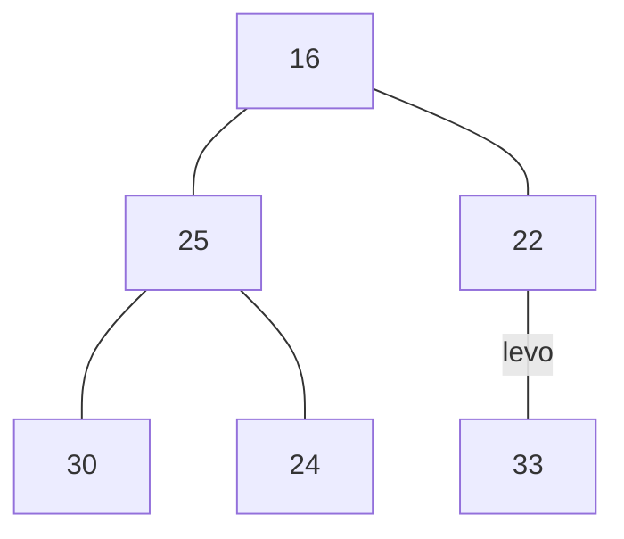
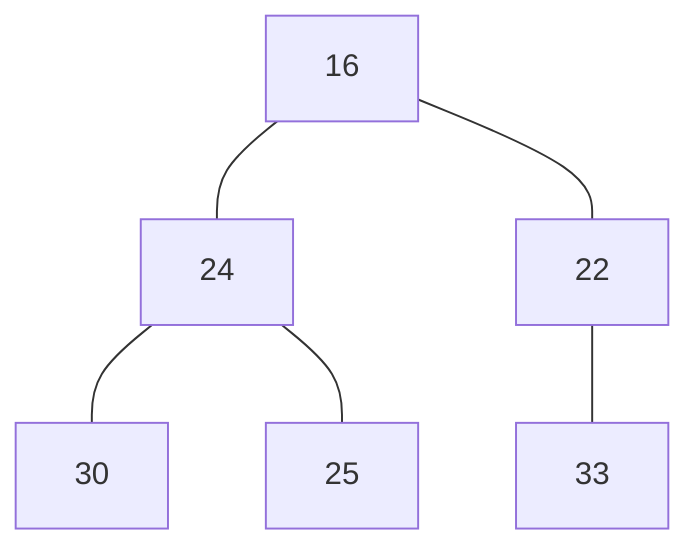

# Vrste s prednostjo
je abstraktna podatkovna struktura.
imamo nabor  elementov, želimo vse vstavit

## Dvojiška kopica
Koren je najmanjši element. je skoraj polno levo poravnano drevo.

### Naloga 1
Vstavi v dvojiško kopico naslednje elemente:

| 44  | 66  | 33  | 88  | 77  | 55  | 22  |
| --- | --- | --- | --- | --- | --- | --- |

doamo 66 (vedno prvo vstavimo v spodnji nivo da je levo pravnano)

dodamo 33(se zamenja )

doamo 88,77,55 in 22

### Naloga 2
izbriši najmanjši element iz naslednje kopice(12)

imamo dve možnosti:
1. pogledam levega otroka in to ponovim pri njemu naprej

zapolnimo škrbino nastalo pri drevesu z najbolj desnim elementom 

2.  damo desnega najnižjega na vrh pa zamenjamo z ta nižjim otrokom

lahko jih tudi predstavimo s polji.

| 1   | 2   | 3   | 4   | 5   | 6   | 7   |
| --- | --- | --- | --- | --- | --- | --- |
| 12  | 16  | 22  | 30  | 25  | 33  | 24  |

če sem na nekem elementu $i=2$
levi otrok je $2i$
desni otrok je $2i+1$
starš je pa $\frac{i}{2}$

vrsta s prednostjo ni slovar, ker ne mormo **iskat** ali pa **brisat**

### Naloga 3
implementiraj abstraktno podatkovno strukturo (APS), ki omogo
## 
je abstraktna struktura ki podpira:
