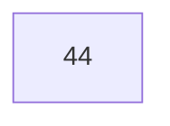
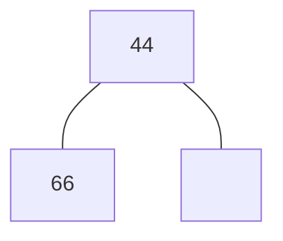
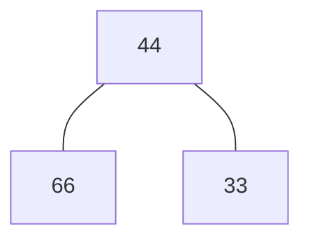
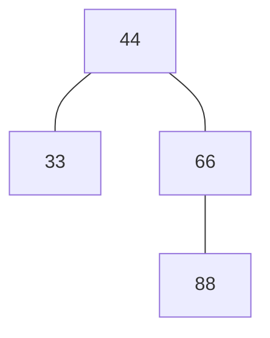

# Vrste s prednostjo
je abstraktna podatkovna struktura.
imamo nabor  elementov, želimo vse vstavit

## Dvojiška kopica
Koren je najmanjši element. je skoraj polno levo poravnano drevo.

### Naloga 1
Vstavi v dvojiško kopico naslednje elemente:

| 44  | 66  | 33  | 88  | 77  | 55  | 22  |
| --- | --- | --- | --- | --- | --- | --- |

doamo 66 (vedno prvo vstavimo v spodnji nivo da je levo pravnano)

dodamo 33

dodamo 88
