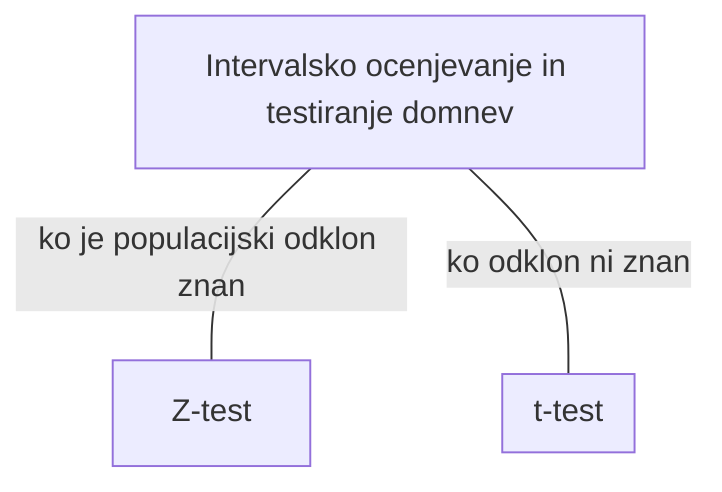

```mermaid
flowchart TD
A[Intervalsko ocenjevanje in testiranje domnev]
subgraph C["t-test"]

end
A-- "ko je populacijski odklon znan" ---B["Z-test"]
A-- "ko odklon ni znan" ---C


%%LINKS
click C "obsidian://open?vault=Zapiski&file=2.%20Letnik%2FStatistika%2F2.kolokvij%2FT-test";

```
# testi
- Z-test ($$)
- T-test ()
- F-test ()
- $\chi^2$-test (opisne spremenljivke)
- 