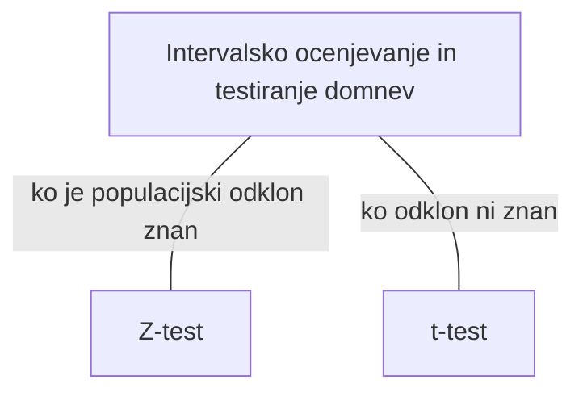
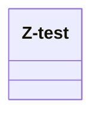

```mermaid
flowchart TD
A[Intervalsko ocenjevanje in testiranje domnev]

A-- "ko je populacijski odklon znan" ---B["Z-test"]
A-- "ko odklon ni znan" ---C["t-test"]


%%LINKS
click C "obsidian://open?vault=Zapiski&file=2.%20Letnik%2FStatistika%2F2.kolokvij%2FT-test";

```

```mermaid
classDiagram

class ZTest["Z-test"]
```