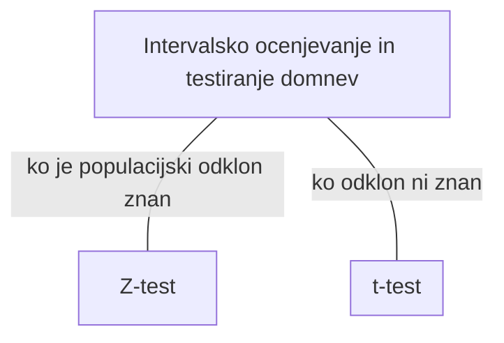

# spremenljivke
- $\mu$ :populacijsko povrpečje
	- $\mu^*$ :izračunano pop. povprečje
-  $\sigma^2$ poulacijska varianca
- $\sigma$ populacijski odklon
- 

# testi

- Z-test ($\sigma$ je znan)
- T-test ($\sigma$ ni znan)
- F-test (povezanost med imensko in intervalsko spremenljivko)
- $\chi^2$-test (opisne spremenljivke)

## Z-test ($\sigma$ je znan)
$H_{0}:$ $\mu=\mu^{*}$
$H_{1}:$
	- **+**
	- **-**
[[Intervalsko ocenjevanje in testiranje statističnih domnev]]

##  T-test ($\sigma$ ni znan)
[[T-test]]

## F-test (povezanost med imensko in intervalsko spremenljivko)
## $\chi^2$-test (opisne spremenljivke)
