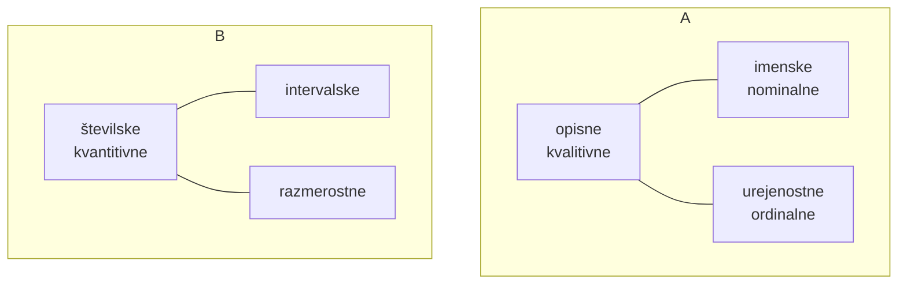

# Spremenljivke

```mermaid
graph TB
subgraph A
	C[opisne <br>kvalitivne]---D[imenske<br> nominalne]
	C---D2[urejenostne <br>ordinalne]
end
subgraph B
	C1[številske <br>kvantitivne]---D3[intervalske]
	C1---D4[razmerostne]
end
```
# Strukture
## Frekvenca
$$f_i^$$