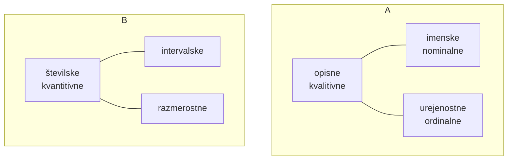

# Spremenljivke

# Strukture
## Frekvenca
$$f_i=\#(X)$$ v neki skupini ali frekvenca enote X za opisne.
## Relativna frekvenca
$$f_i°=\frac{f_i}{\sum_{i=1}^{K}f_i}$$
v odstotkih:$$f_i\%=100*\frac{f_i}{\sum_{i=1}^{K}f_i}$$
za njih uporabimo **hitogram** ali **tortni diagram**
## Komulativna frekvenca
$$F_j=\#(X\le a_j)$$ sum prejšnih razredov
## Relatvina komulativna frekvenca
$$$$