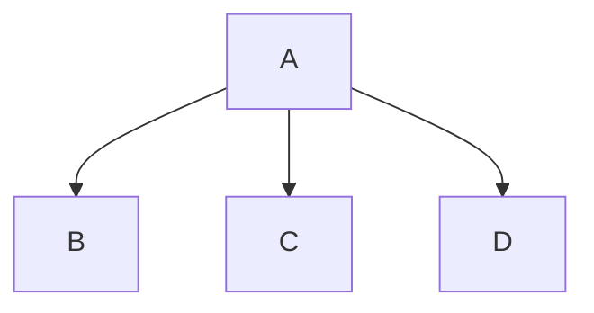
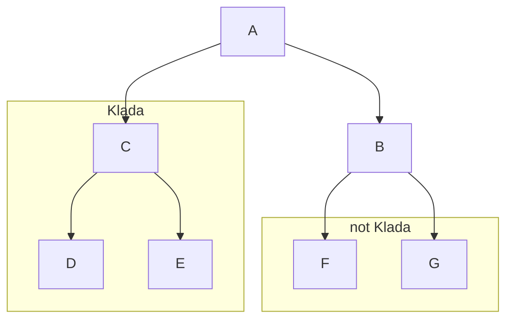
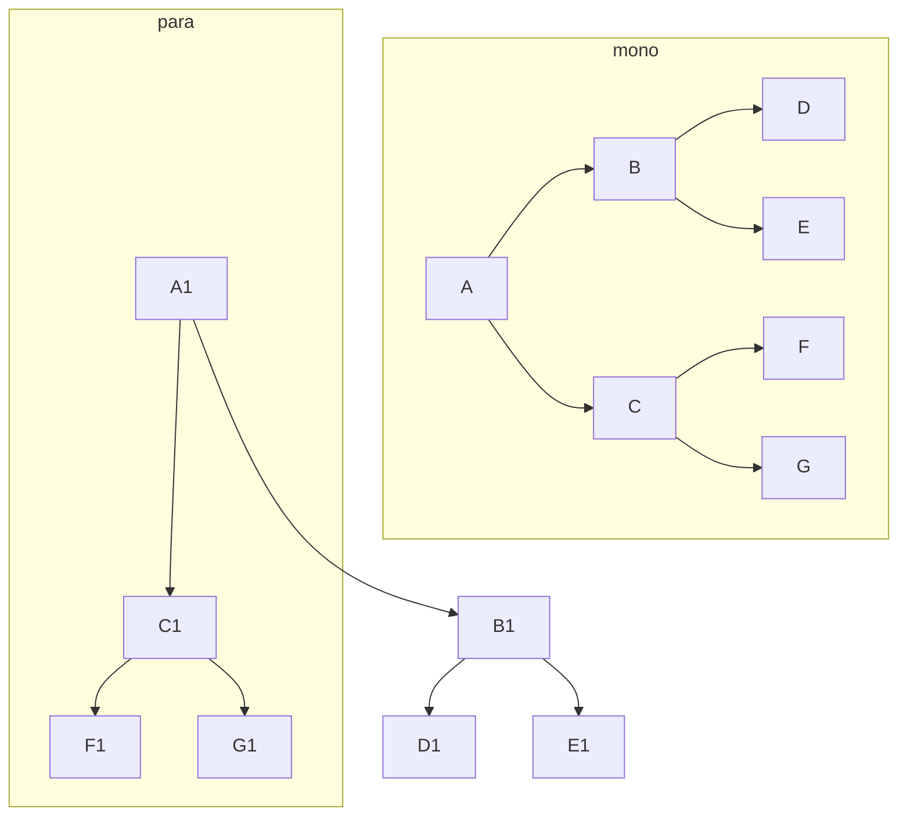

-> [Home](3.%20Letnik/1.Semester/Evolucijska%20in%20populacijska%20genomika/Uvod.md)
# Mitohondriji
$\color{red}{is\ the\ powerhouse\ of\ the\ cell}$

# Filogenetska drevesa
- **Kladogram** samo prikazuje sorodstvene odnose
- **Filogram** prikazuje sorodstvene odnose in evolucijske (dolžina pomeni podobnost)

**politomija** nerazrešeni odnosi, - ko ni binomsko razcepljeno

**kalada** je skupina organizmov, ki vklučuje skupnega prednika.

### Veje
**monofiletska** vklučuje prednika
**parafiletska** ne vklučuje prednika

**Zunanja veje** določajo taksonomske skupine.
